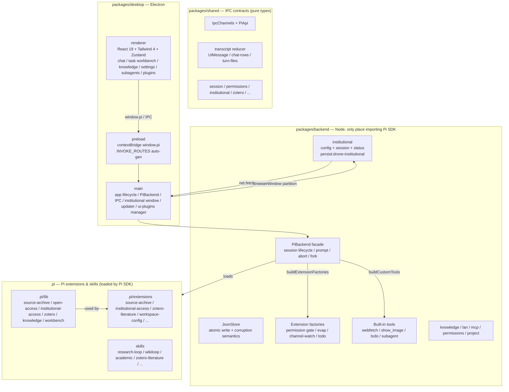

<p align="center">
  
</p>
<h1 align="center">Drone</h1>
<p align="center">
  An autonomous research workbench on your desktop. Approve a task once — scope, write directories and acceptance criteria — and Drone runs it to delivery instead of interrupting you at every step. Built on the <a href="https://www.npmjs.com/package/@earendil-works/pi-coding-agent">Pi coding agent</a>, the same engine as the Pi CLI.
</p>
<p align="center">
  <a href="LICENSE"></a>
  <a href="https://github.com/Gyoungwe/Drone/releases"></a>
  <a href="https://github.com/Gyoungwe/Drone/releases"></a>
  <a href="https://github.com/Gyoungwe/Drone/actions/workflows/ci.yml"></a>
  <a href="https://github.com/Gyoungwe/Drone"></a>
  =22.19">
  
</p>
<p align="center">
  <a href="README.md">English</a> | <a href="README.zh.md">简体中文</a>
</p>

---

## Demo


**Chat**


**Custom background & dark theme**


**Settings — providers & models**


## Why Drone?

Most agent GUIs ask you to approve every write, every command and every stage. Drone asks **once**.

A task starts with bounded read-only discovery, then presents a single authorization card: the goal, a plain-language scope summary, the exact write directories and immutable acceptance criteria. One click — **approve once, run to delivery** — approves the acceptance contract and the execution budget, and the task runs to delivery.

- **One authorization per task** — consent is bound to an immutable contract hash over task id, goal, scope, directory list and acceptance milestones. Change the contract and consent is revoked; it never transfers to another task, session or branch.
- **Scoped, not unlimited** — approved writes apply only under canonical directories you saw on the card. Explicit deny rules, credentials, permission/trust/model configuration, private keys, VCS internals, symlink escape and hard-linked targets all keep their gates. Not a fullAccess switch.
- **Progress you can audit** — stages advance on observed progress only: successful results of host-allowed, distinct calls. Status spam and failed checks do not count. Recovery is capped at 3 host-triggered turns inside a fixed 192-call ceiling, with automatic handoff up to 16 times when the model ends early but progress exists.
- **Structured task workbench** — model-proposed milestones with dependencies, acceptance satisfied only by host file readback, scoped human review or read-only Zotero identity. The durable ledger survives restarts without replaying unknown side effects.

See [docs/task-authorization.md](docs/task-authorization.md) for the full boundary list.

## Architecture

Drone is an npm workspaces monorepo with a strict trust boundary: renderer never imports Pi, only talks via `window.pi`.



### 1. `packages/shared` — single source of truth for IPC

- `ipc.ts`: `IpcChannels` constants + `PiApi` (full `window.pi` type). Adding a channel requires 4 sync points: `shared/ipc.ts` → `preload/index.ts` (auto via `INVOKE_ROUTES`) → `main/ipc/<domain>.ts` → backend method + `main/ipc/index.ts` event forwarding.
- `session.ts`: `SessionMeta`, `SessionEvent` (Pi `AgentSessionEvent` ∪ Drone UI events like `subagent_mutex`, `model_wait`), `SessionMessage` (user/assistant with `entryId` for fork/recall, `image`, `subagent`), permission modes, trust.
- `transcript/`: UI message state machine shared by desktop and lan-web — reducer, mapping, chat-rows grouping, turn-files aggregation, patch parsing, timing derivation.
- `institutional.ts` (new): `InstitutionalConfig` (ezproxyTemplate auto-saved, perTaskLimit, lastLoginAt), `InstitutionalStatus`, `InstitutionalTestResult`.
- `permission-settings.ts`, `zotero.ts`, `example-tasks.ts`, `subagent.ts`, etc.

### 2. `packages/backend` — Pi SDK adapter, pure Node

- `pi-backend.ts` is the **only** file importing `@earendil-works/pi-coding-agent` (pinned 0.84.3). Facade for session lifecycle: create/open/close/delete/prompt (followUp queue, preflight receipt), abort/fork/recall/compact, model listing, permission mode map (memory, injected via closure into extensions), event/permission/trust distribution (`respondPermission` first gate.respond then persist).
- `json-store.ts`: unified JSON persistence (tmp+rename atomic, corruption tri-state).
- `institutional/`: 
  - `config.ts`: loads `~/.pi/agent/institutional.json` via `JsonStore`, `buildProxiedUrl` (supports `%s` and `?url=`), `inferEzproxyTemplateFromUrl` / `detectAndSaveTemplateFromUrl` auto-infers template from navigated URL like `.../login?url=https://www.nature.com/...` → `.../login?url=%s` and saves without manual input.
  - `session.ts`: Electron `session.fromPartition('persist:drone-institutional')`, `net.fetch` with session, cookie count, `openInstitutionalLoginWindow` / `openInstitutionalUrlInWindow` with `did-navigate` auto-detect.
  - `status.ts`: `getInstitutionalStatus` (config + cookiesCount + loggedIn heuristic).
- `permissions/`, `project/`, `session/`, `settings/`, `tools/`, `lan/`, `knowledge/`, `zotero/`, `mcp/`.

### 3. `packages/desktop` — Electron app

**main/**:
- `index.ts`: app lifecycle, initLogging, `pi-bg://` protocol for custom backgrounds, renderer crash handler (auto-reload, incident snapshot), `new PiBackend()`, LAN observer, `UiPluginManager`, `registerIpc`, updater, `createWindow`. First 3 lines must import `pi-package-dir`, `dev-agent-dir`, `fix-path`.
- `institutional-access.ts`: re-exports backend window funcs (`openInstitutionalLoginWindow`), plus `testAccess` that tries ezproxy + institutional_session via `institutionalFetch`.
- `ipc/`: per-domain handlers (sessions, settings, permissions, institutional, knowledge, etc.) — thin delegates to backend; `index.ts` composes them and forwards backend events to renderer.
- `ui-plugins/`: esbuild builder (shims `window.DroneUI`), manager (scan, build, fs.watch hot-reload, seed builtin pets).
- `window.ts`, `tabs.ts`, `ui-state.ts`, `updater.ts`, etc.

**preload/**: `index.ts` — `contextBridge.exposeInMainWorld('pi', api)` where `api` = auto-generated from `INVOKE_ROUTES` + event subscriptions. Must stay CJS (sandbox).

**renderer/**: React 19 + Tailwind 4 + Zustand
- `App.tsx`: view switching (chat/projects) + `use-session-event-bridge` (EventConflator rAF coalescing).
- `stores/`: sessions (draft `draft:` prefix, `ensureSession`, `loadSessionBundle`), transcript (re-exports shared reducer), drafts, permissions, settings, catalog, provider-login, etc.
- `components/knowledge/InstitutionalAccessSection.tsx` (new): auto mode — no manual template input, shows auto-saved template, login status, Cookie count, one-click login that auto-saves template, test access, explains agent flow.
- `components/chat/`: MessageList (tail-follow), ToolCallCard, SubagentRunCard, TodoPanel, TurnDiffChip, RunInspector, etc.
- `plugins/`: slots/registry/Slot/RegionHost/PluginBoundary/host-api/loader — UI plugin runtime.
- `i18n/`: zh/en dictionaries.

### 4. `.pi` — Pi extensions & research workbench

Loaded by Pi SDK via `ProjectResourceLoader` (two-phase trust).

- `.pi/lib/source-archive.mjs`: `archiveSource` — validates `run_dir` inside results root, tries given URL, then legitimate OA chain (`open-access.mjs`: Europe PMC → PMC Article Datasets S3 → Europe PMC render → Unpaywall → OpenAlex → Semantic Scholar → Crossref), then **institutional** (if configured + Electron available + under per-task limit): builds proxied URLs via `buildProxiedUrl`, tries `institutionalFetch`, detects login pages, persists with `open_access.source='institutional'`. Returns `no_open_access` / `institutional_auth_required` / `institutional_limit_reached` / `browser_required`.
- `.pi/lib/institutional-access.mjs`: JS mirror of backend institutional (config load, buildProxiedUrl, inferTemplate, institutionalFetch via Electron).
- `.pi/extensions/institutional-access.mjs` (new): registers `research_institutional_login` (opens persistent institutional window, auto-saves template) and `research_institutional_status`.
- `.pi/extensions/source-archive.mjs`: `research_archive_source` tool definition (description mentions institutional statuses, never pirate mirrors).
- `zotero-literature.mjs`, `workspace-config.mjs`, `obsidian-workbench.mjs`, `research-loop.mjs`, `knowledge/`, etc.
- `skills/`: `research-loop`, `wikiloop`, academic packs (Nature, Scientific, Academic Research Skills CC BY-NC), `zotero-literature`.

### 5. Research workbench flow

```
task_plan → authorization card (contractHash) → one auth covers all milestones (auto-handoff up to 16)
  → research_loop / research_wikiloop
    → resolveOpenAccess (legitimate OA) → archiveSource → institutionalFetch (if needed, agent requests login via research_institutional_login, template auto-saved)
    → evidence gate / claim binding → research_summarize_run → Obsidian Vault notes + Zotero
```

- **One authorization loop** (`workbench.mjs` `reserveHandoff` at `agent_end` when progress exists, no pending user actions, no unknown ops, <192 calls): model can end turn early, host hands back under same authorization with `automatic-handoff` reason.
- **Per-task institutional cap**: `download-manifest.json` counts `open_access.source==='institutional'`, default 20, stops with `institutional_limit_reached`.

### 6. Other subsystems

- **Permissions**: `permissions.json` global, per-tool ordered pattern table, self-protection patterns, dry-run probe, audit tail. Scoped writes via `drone:task-write-consent` event.
- **Trust**: project trust prompt, `workspaces.json` roots + allowed patterns.
- **Context evaporation**: on by default, 4-level waterline, context hook, `replay-evaporation.mts` tuning.
- **Subagents**: built-in scout + user/project agents, single/parallel cap 8/concurrency 4, isolated `AgentSession`, `sessions-subagents/` readOnly, `@` selector in composer.
- **LAN observer**: `lan-web/` Vite single-file, QR code, token rotation, GET-only SSE.
- **UI plugins**: slots `panel.artifacts.card`, `panel.task.milestone-evidence`, `panel.tab`, `rail.view`, regions `SettingsPanel`, etc.; esbuild rewrites react to `window.DroneUI` shim; hot-reload via fs.watch.

## Built on Pi

Drone embeds the official Pi SDK (`@earendil-works/pi-coding-agent`) in the Electron main process. It is **not a fork and not a reimplementation** — it runs the same engine as the Pi CLI and inherits Pi's native strengths:

- **Extensibility** — TypeScript extensions, skills, and prompt templates installed for the Pi CLI work here too, including project-local ones (with a trust prompt before loading).
- **Shared configuration** — same `~/.pi/agent/` directory as the CLI: sessions, auth, and model settings carry over.
- **Providers** — subscriptions (Claude Pro/Max, ChatGPT Plus/Pro Codex, GitHub Copilot, in-app OAuth) and API keys for Anthropic, OpenAI, Gemini, DeepSeek, Bedrock, etc.; custom providers and base-URL overrides.

And for GUI lovers:

- Highly customizable UI — swap tool-call cards, desk-pet overlays (whale-maid pets ship built in), extend settings panel via UI plugins
- Visual permission gates — approve/deny from a dock, backed by per-tool rule engine
- Draggable multi-session tabs, per-session drafts, follow-up queue with undo
- Built-in subagents — scout + your own definitions, parallel fan-out, run cards inspectable read-only. “scout the repo” / “侦察一下代码库” starts Scout; composer shows “子代理 x1” / “Scout 已完成”
- Context evaporation (on by default), unified error system with retry, solid workspace (fork, recall, todo, diff, slash menu, @-file completion)
- Streaming markdown, image previews, `show_image` tool for agent-initiated display
- Custom background with dimming, light/dark/system themes
- LAN observer — watch read-only from phone/tablet via QR

## Institutional Access (new)

**One-time login, auto-saved template, no manual setup.**

- Agent encounters paywall → `research_archive_source` returns `institutional_auth_required` → agent calls `research_institutional_login` → opens persistent institutional window (`persist:drone-institutional`) → you log in via EZproxy / Shibboleth / CARSI / OpenAthens / WebVPN → system auto-detects EZproxy template like `https://ezproxy.xxx.edu/login?url=%s` from navigated URL and saves to `~/.pi/agent/institutional.json` → retry download via `net.fetch({ session })`, respecting per-task cap (default 20).
- UI: Settings → Zotero → Institutional Access — shows login status, Cookie count, auto-saved template, one-click login (auto-saves), test access.
- Compliant: uses only your own institutional cookies, never pirate mirrors. See [docs/institutional-access.md](docs/institutional-access.md).

## Example Tasks

Six built-in example tasks, one per direction (planning → hypotheses, evidence → literature and evidence cards, analysis → data quality and tests, writing → one section plus review, presentation → figures and slides, engineering → resource inventory and handoff). They appear as cards in empty Tasks tab and as “Example: …” rows in `/` menu; a dialog collects inputs (file/folder pickers, milestone preview) and sends one ordinary first message through composer. Examples never pre-create tasks or files; `task_plan` + authorization card stay the only entry. Data lives in `packages/shared/src/example-tasks.json`, see [docs/example-tasks.md](docs/example-tasks.md).

## Download

Prebuilt installers on [Releases](https://github.com/Gyoungwe/Drone/releases).

| Platform | Download |
| --- | --- |
| macOS (Apple Silicon) | `drone-mac-arm64.dmg` |
| macOS (Intel) | `drone-mac-x64.dmg` |
| Windows | `drone-windows-x64.exe` or `drone-windows-x64.zip` |
| Linux (x64) | `drone-linux-x64.AppImage` or `drone-linux-x64.deb` |

> Linux AppImage needs FUSE 2 (`libfuse2`) or `APPIMAGE_EXTRACT_AND_RUN=1`. `.deb` needs `libsecret-1-0`. Builds are ad-hoc signed (no cert). macOS first launch may show “Apple cannot verify…”: System Settings → Privacy & Security → Open Anyway, or `xattr -cr "/Applications/Drone.app"`. Updates checked in-app; Windows auto-installs, macOS jumps to Releases (Gatekeeper again). SmartScreen: More info → Run anyway.

## Configuration

API keys never stored in repo or bundle. `~/.pi/agent/models.json` references env vars (e.g. `$AI_OPS_API_KEY`). If you already use Pi CLI, your setup just works. Built-in DeepSeek models use catalog names like **V4 Flash**, not `deepseek-chat`. If picker empty, Settings → Models → add provider key.

## Development

Prerequisites: **Node.js >= 22.19**.

```bash
npm install
npm run dev
```

Monorepo: `shared` (IPC), `backend` (only Pi SDK import), `desktop` (Electron + React 19 + Tailwind 4 + Zustand). Commands: `npm run typecheck` / `test` / `lint` / `build` / `dist`.

See [CONTRIBUTING.md](CONTRIBUTING.md) and [docs/INDEX.md](docs/INDEX.md) (hard constraints + file map) + [docs/PITFALLS.md](docs/PITFALLS.md) before changing code. Dev data isolated to `~/.pi/agent-dev/` (see `main/dev-agent-dir.ts`). If Electron binary download stalls in China, `ELECTRON_MIRROR=https://npmmirror.com/mirrors/electron/`.

## Disclaimer

Drone is a community project. Not built by or affiliated with Pi team (earendil-works).

## License

[MIT](LICENSE)

## Research workbench distribution

Bundles native knowledge service and research workflow, plus presentation fallback. Model credentials, optional external search/MCP adapters, private Vaults and local scientific software remain user setup. See [distribution capability boundaries](docs/distribution-parity.md) and [model-assisted Wiki review](docs/wiki-model-review.md). Main-branch push updates source; version-tagged Release needed for installers.

### Third-party research skill packs

Installers bundle three commit-pinned upstream skill packs, unmodified with license files: [Nature Skills](https://github.com/Yuan1z0825/nature-skills) (Apache-2.0), filtered subset of [Scientific Agent Skills](https://github.com/K-Dense-AI/scientific-agent-skills) (MIT) and [Academic Research Skills](https://github.com/Imbad0202/academic-research-skills) © Cheng-I Wu, licensed under [CC BY-NC 4.0](https://creativecommons.org/licenses/by-nc/4.0/). Drone itself MIT and free; ARS pack noncommercial only, not covered by MIT. Details: [docs/research-skill-packs.md](docs/research-skill-packs.md).
