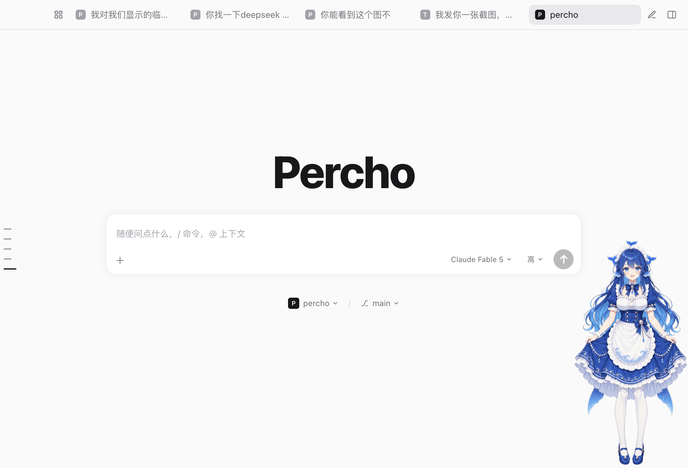
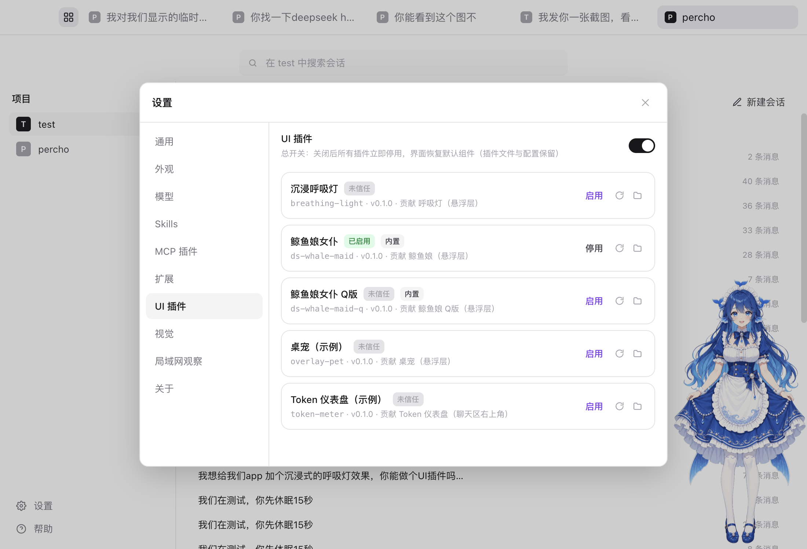
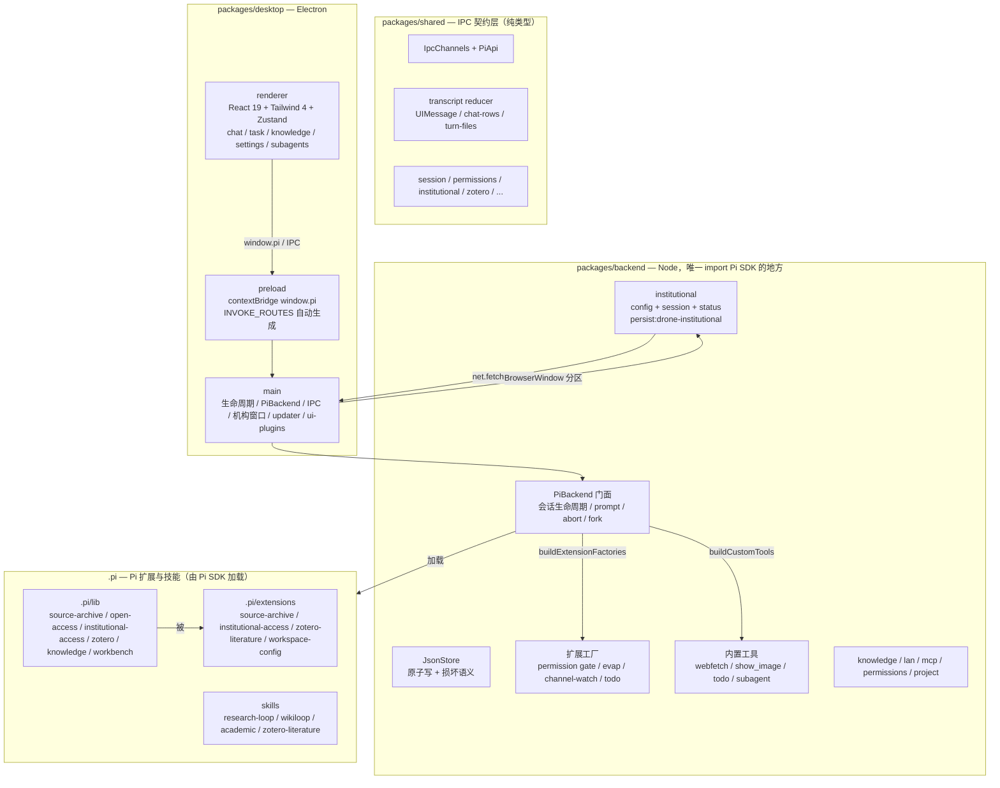

<p align="center">
  
</p>
<h1 align="center">Drone</h1>
<p align="center">
  桌面端的自主研究工作台。一次确认任务的范围、写入目录与验收标准，Drone 就执行到交付，而不是每一步都来打断你。基于 <a href="https://www.npmjs.com/package/@earendil-works/pi-coding-agent">Pi coding agent</a> 构建，与 Pi CLI 同源同引擎。
</p>
<p align="center">
  <a href="LICENSE"></a>
  <a href="https://github.com/Gyoungwe/Drone/releases"></a>
  <a href="https://github.com/Gyoungwe/Drone/releases"></a>
  <a href="https://github.com/Gyoungwe/Drone/actions/workflows/ci.yml"></a>
  <a href="https://github.com/Gyoungwe/Drone"></a>
  =22.19">
  
</p>
<p align="center">
  <a href="README.md">English</a> | <a href="README.zh.md">简体中文</a>
</p>

---

## 演示





**聊天页**


**自定义背景 + 深色主题**


**设置页 —— 模型与 Provider**


## 为什么选择 Drone？

大多数 agent 图形界面会为每一次写入、每一条命令、每一个阶段向你确认。Drone 只问**一次**。

任务从有限的只读调研开始，然后给出一张授权卡：目标、大白话的范围说明、确切的写入目录、不可变的验收标准。点一次 **确认一次，执行到交付**，即批准验收合同与执行预算，任务一路跑到交付。

- **一个任务一次授权** —— 同意被绑定到任务 id、目标、范围、目录清单与验收里程碑的不可变合同哈希上。合同一改，授权即失效；不会迁移到另一个任务、会话或分支。
- **是范围授权，不是无限授权** —— 自动放行仅限你在卡片上看到的规范化目录。显式 deny 规则、凭据、权限/信任/模型配置、私钥、版本库内部文件、符号链接逃逸与硬链接目标，一律保留原有门控。这不是 fullAccess 开关。
- **进度可审计** —— 阶段只凭可观测进度推进：宿主放行的、互不相同的调用的成功结果。状态刷屏与失败检查不算数。恢复轮次上限 3 次，且在固定 192 次调用上限内，模型提前结束但有进度时自动续作最多 16 次。
- **结构化任务工作台** —— 模型提出带依赖的里程碑，验收只认宿主文件回读、范围内人工复核或只读 Zotero 身份。持久化账本重启后恢复，且不会重放未知副作用。

完整边界见 [docs/task-authorization.md](docs/task-authorization.md)。

## 架构总览

Drone 是 npm workspaces monorepo，硬约束：renderer 绝不 import pi，只经 `window.pi` 通信。



### 1. `packages/shared` — 跨进程契约

- `ipc.ts`：`IpcChannels` 常量 + `PiApi`（`window.pi` 完整类型）。新增通道需四处同步：`shared/ipc.ts` → `preload/index.ts`（`INVOKE_ROUTES` 自动）→ `main/ipc/<domain>.ts` → backend 方法 + `main/ipc/index.ts` 事件转发。
- `session.ts`：`SessionMeta`、`SessionEvent`（Pi 原生 + Drone 自有如 `subagent_mutex`、`model_wait`）、`SessionMessage`（带 `entryId` 供 fork/撤回，`image`、`subagent`）。
- `transcript/`：桌面与 lan-web 共用的 UI 消息状态机 — reducer、mapping、chat-rows 分组、turn-files 聚合、patch 解析、计时派生。
- `institutional.ts`（新增）：`InstitutionalConfig`（ezproxyTemplate 自动保存、perTaskLimit、lastLoginAt）、`InstitutionalStatus`。
- `permission-settings.ts`、`zotero.ts`、`example-tasks.ts`、`subagent.ts` 等。

### 2. `packages/backend` — Pi SDK 适配层，纯 Node

- `pi-backend.ts` 是**唯一** import Pi SDK 的文件（钉 0.84.3）。门面：create/open/close/delete/prompt（followUp 排队、preflight 回执）、abort/fork/recall/compact、模型列表、权限模式 map（内存态，经闭包注入扩展）、事件与权限·信任分发（`respondPermission` 先放行再持久化）。
- `json-store.ts`：统一 JSON 持久化（tmp+rename 原子写、损坏三态）。
- `institutional/`：
  - `config.ts`：读 `~/.pi/agent/institutional.json`，`buildProxiedUrl`（支持 `%s` 与 `?url=`），`inferEzproxyTemplateFromUrl` / `detectAndSaveTemplateFromUrl` 自动从导航 URL 如 `.../login?url=https://www.nature.com/...` 推断模板 `.../login?url=%s` 并保存，无需手动。
  - `session.ts`：Electron `session.fromPartition('persist:drone-institutional')`、`net.fetch` 带会话、Cookie 计数、`openInstitutionalLoginWindow` / `openInstitutionalUrlInWindow`（`did-navigate` 时自动识别模板）。
  - `status.ts`：`getInstitutionalStatus`（配置 + Cookie 数 + 是否已登录）。
- `permissions/`、`project/`、`session/`、`settings/`、`tools/`、`lan/`、`knowledge/`、`zotero/`、`mcp/`。

### 3. `packages/desktop` — Electron 应用

**main/**：
- `index.ts`：生命周期、日志、`pi-bg://` 协议、崩溃钩子（自动 reload、incident snapshot）、`new PiBackend()`、LAN、`UiPluginManager`、`registerIpc`、updater、建窗。首三行必须 import `pi-package-dir`、`dev-agent-dir`、`fix-path`。
- `institutional-access.ts`：复用 backend 窗口函数，`testAccess` 经 ezproxy + institutional_session 尝试。
- `ipc/`：按域拆分（sessions、settings、permissions、institutional、knowledge 等），薄委托 backend；`index.ts` 拼装并转发事件。
- `ui-plugins/`：esbuild 构建器（`window.DroneUI` shim）、manager（扫描、构建、fs.watch 热重载、内置桌宠）。
- `window.ts`、`tabs.ts`、`ui-state.ts`、`updater.ts` 等。

**preload/**：`index.ts` — `contextBridge.exposeInMainWorld('pi', api)`，`api` 由 `INVOKE_ROUTES` 自动生成 + 事件订阅。必须保持 CJS。

**renderer/**：React 19 + Tailwind 4 + Zustand
- `App.tsx`：视图切换 + `use-session-event-bridge`（EventConflator rAF 合流）。
- `stores/`：sessions（draft `draft:` 前缀、`ensureSession`、`loadSessionBundle`）、transcript、drafts、permissions、settings、catalog、provider-login 等。
- `components/knowledge/InstitutionalAccessSection.tsx`（新增）：自动模式 — 无需手动模板输入，展示自动保存的模板、登录态、Cookie 数，一键登录自动保存模板，测试访问，说明 Agent 流程。
- `components/chat/`：MessageList（尾随跟随）、ToolCallCard、SubagentRunCard、TodoPanel、TurnDiffChip、RunInspector 等。
- `plugins/`：slots/registry/Slot/RegionHost/PluginBoundary/host-api/loader — UI 插件运行时。
- `i18n/`：中英字典。

### 4. `.pi` — Pi 扩展与研究工作台

由 Pi SDK 经 `ProjectResourceLoader` 两阶段信任加载。

- `.pi/lib/source-archive.mjs`：`archiveSource` — 校验 `run_dir`，尝试给定 URL，然后合法 OA 链（`open-access.mjs`：Europe PMC → PMC S3 → Europe PMC render → Unpaywall → OpenAlex → Semantic Scholar → Crossref），然后**机构通道**（已配置 + Electron 可用 + 未超每任务上限）：经 `buildProxiedUrl` 构造代理 URL，`institutionalFetch` 尝试，检测登录页，持久化 `open_access.source='institutional'`。返回 `no_open_access` / `institutional_auth_required` / `institutional_limit_reached` / `browser_required`。
- `.pi/lib/institutional-access.mjs`：backend institutional 的 JS 镜像（含自动推断）。
- `.pi/extensions/institutional-access.mjs`（新增）：注册 `research_institutional_login`（打开持久机构窗口，自动保存模板）与 `research_institutional_status`。
- `.pi/extensions/source-archive.mjs`：`research_archive_source` 工具定义（说明新状态，绝不走盗版）。
- `zotero-literature.mjs`、`workspace-config.mjs`、`obsidian-workbench.mjs`、`research-loop.mjs`、`knowledge/` 等。
- `skills/`：`research-loop`、`wikiloop`、学术技能包（Nature、Scientific、Academic Research Skills CC BY-NC）、`zotero-literature`。

### 5. 研究工作台流程

```
task_plan → 授权卡（contractHash）→ 一次授权覆盖全部里程碑（自动续作最多 16 次）
  → research_loop / wikiloop
    → resolveOpenAccess（合法 OA）→ archiveSource → institutionalFetch（需要时 Agent 调 research_institutional_login，模板自动保存）
    → evidence gate / claim 绑定 → research_summarize_run → Obsidian Vault 笔记 + Zotero
```

- **一次授权闭环**（`workbench.mjs` `reserveHandoff` 在 `agent_end` 时有新进度、无等待用户、无 unknown、<192 调用）：模型可提前结束回合，宿主在同授权下自动续作，reason `automatic-handoff`。
- **机构每任务上限**：`download-manifest.json` 统计 `open_access.source==='institutional'`，默认 20，超限返回 `institutional_limit_reached`。

### 6. 其他子系统

- **权限**：全局 `permissions.json`，逐工具有序模式表，自保护模式，试算 probe，审计尾部。范围写入经 `drone:task-write-consent` 事件。
- **信任**：项目信任弹窗，`workspaces.json` roots + allowed 记忆。
- **上下文蒸发**：默认开启，四级水位线，context 钩子，`replay-evaporation.mts` 调参。
- **子代理**：内置 scout + 用户/项目 agent 定义，single/parallel cap 8/并发 4，隔离 `AgentSession`，`sessions-subagents/` 只读，输入框 `@` 选择器。
- **局域网观察**：`lan-web/` Vite 单文件，扫码只读，token 轮换，GET-only SSE。
- **UI 插件**：槽位 `panel.artifacts.card`、`panel.task.milestone-evidence`、`panel.tab`、`rail.view`，区域 `SettingsPanel` 等；esbuild 重写 react 到 `window.DroneUI` shim；热重载。

## 基于 Pi 构建

Drone 把官方 Pi SDK 跑在 Electron 主进程里。**不是 fork，也不是重新实现** —— 与 Pi CLI 同引擎，完整继承：

- **可扩展性** —— Pi CLI 的扩展、Skills、Prompt 模板在这里同样生效，包括项目级（加载前信任确认）。
- **配置共享** —— 共用 `~/.pi/agent/`：会话、认证、模型配置互通。
- **模型来源** —— 订阅（Claude Pro/Max、ChatGPT Plus/Pro Codex、GitHub Copilot，应用内 OAuth）与 API key（Anthropic、OpenAI、Gemini、DeepSeek、Bedrock 等）；自定义 provider 与 base URL 覆写。

图形界面额外提供：

- 高度自定义界面 — 替换工具卡、桌宠浮层（内置鲸鱼娘两只）、扩展设置面板
- 可视化权限审批 — 底部审批坞逐个批准/拒绝
- 多会话顶栏标签（可拖拽、可选左侧轨道）、逐会话草稿、可撤销跟进队列
- 内置子代理 — scout + 自定义，点运行卡只读检视子会话。自然语言「侦察一下代码库」/ scout the repo 启动 Scout；状态显示「子代理 x1」/「Scout 已完成」
- 上下文蒸发（默认开启）、统一报错系统（错误卡一键重试）、扎实工作台（分叉、撤回、todo、diff、斜杠菜单、@ 文件补全）
- 流式 Markdown、图片预览、`show_image` 工具让 agent 主动发图
- 自定义背景与遮罩、浅色/深色/跟随系统主题
- 局域网观察 — 手机/平板扫码只读查看

## 机构访问（新增）

**一次登录，自动保存模板，无需手动设置。**

- Agent 遇到付费墙 → `research_archive_source` 返回 `institutional_auth_required` → Agent 调 `research_institutional_login` 打开持久机构窗口（`persist:drone-institutional`）→ 你完成学校登录（EZproxy / Shibboleth / CARSI / OpenAthens / WebVPN）→ 系统自动从 URL 如 `.../login?url=https://www.nature.com/...` 识别模板 `.../login?url=%s` 并保存到 `~/.pi/agent/institutional.json` → 重试下载，经 `net.fetch({ session })` 自动下载，尊重每任务上限（默认 20）。
- UI：设置 → 文献库 → 机构访问 — 显示登录态、Cookie 数、自动保存的模板，一键登录（自动保存）、测试访问。
- 合规：仅用你自己的机构 Cookie，绝不走盗版。见 [docs/institutional-access.md](docs/institutional-access.md)。

## 示例任务

六个内置示例任务，每方向一个（规划→假说、证据→文献与证据卡、分析→数据质量与测试、写作→一节+审稿、展示→图表与幻灯片、工程→资源盘点与交接）。空任务页签与 `/` 菜单末尾「Example: …」可见；对话框收集输入（文件/文件夹选择、里程碑预览）后经输入框发送一条普通首消息。示例绝不预创建任务或文件；`task_plan` + 授权卡仍是唯一入口。数据在 `packages/shared/src/example-tasks.json`，见 [docs/example-tasks.md](docs/example-tasks.md)。

## 下载

预编译安装包在 [Releases](https://github.com/Gyoungwe/Drone/releases)。

| 平台 | 下载 |
| --- | --- |
| macOS (Apple Silicon) | `drone-mac-arm64.dmg` |
| macOS (Intel) | `drone-mac-x64.dmg` |
| Windows | `drone-windows-x64.exe` 或 `drone-windows-x64.zip` |
| Linux (x64) | `drone-linux-x64.AppImage` 或 `drone-linux-x64.deb` |

> Linux AppImage 需 FUSE 2（`libfuse2`）或 `APPIMAGE_EXTRACT_AND_RUN=1`。`.deb` 需 `libsecret-1-0`。构建为 ad-hoc 签名（无证书）。macOS 首次打开可能提示“Apple 无法验证…”，系统设置 → 隐私与安全性 → 仍要打开，或 `xattr -cr "/Applications/Drone.app"`。应用内检查更新；Windows 可自动安装，macOS 会跳 Releases 页（再次 Gatekeeper）。SmartScreen：更多信息 → 仍要运行。

## 配置

API key 绝不进仓库或包体。`~/.pi/agent/models.json` 引用环境变量（如 `$AI_OPS_API_KEY`）。若已用 Pi CLI，现有配置直接可用。内置 DeepSeek 模型用目录展示名如 **V4 Flash**，而非 `deepseek-chat`。选择器为空时，设置 → 模型 → 添加 provider key。

## 开发

前置：**Node.js >= 22.19**。

```bash
npm install
npm run dev
```

Monorepo：`shared`（IPC）、`backend`（唯一 Pi SDK import）、`desktop`（Electron + React 19 + Tailwind 4 + Zustand）。常用：`npm run typecheck` / `test` / `lint` / `build` / `dist`。

改代码前读 [docs/INDEX.md](docs/INDEX.md)（硬约束 + 文件地图）与 [docs/PITFALLS.md](docs/PITFALLS.md)。dev 数据隔离到 `~/.pi/agent-dev/`（`main/dev-agent-dir.ts`）。中国区 Electron 二进制下载卡住时，`ELECTRON_MIRROR=https://npmmirror.com/mirrors/electron/`。

## 免责声明

Drone 是社区项目，与 Pi 团队（earendil-works）无关。

## 许可证

[MIT](LICENSE)

## 研究工作台分发

内置原生知识服务与研究工作流，以及展示兜底。模型凭证、可选外部搜索/MCP 适配器、私有 Vault、本地科学软件仍需用户自行配置。见 [distribution capability boundaries](docs/distribution-parity.md) 与 [model-assisted Wiki review](docs/wiki-model-review.md)。main 分支推送更新源码；打版本标签的 Release 才更新安装包。

### 第三方研究技能包

安装包内捆绑三个 commit-pinned 上游技能包，原样带许可证：[Nature Skills](https://github.com/Yuan1z0825/nature-skills)（Apache-2.0）、[Scientific Agent Skills](https://github.com/K-Dense-AI/scientific-agent-skills) 子集（MIT）与 [Academic Research Skills](https://github.com/Imbad0202/academic-research-skills) © Cheng-I Wu，[CC BY-NC 4.0](https://creativecommons.org/licenses/by-nc/4.0/)。Drone 本身 MIT 且免费分发；ARS 包仅限非商业使用，不在 MIT 范围内。详情见 [docs/research-skill-packs.md](docs/research-skill-packs.md)。
