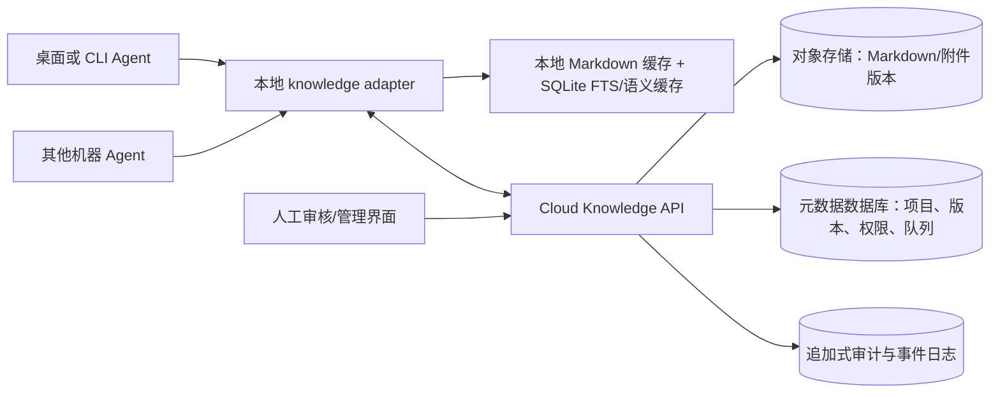

# 云端知识库与科研化产品升级方案

- **调研范围**：本仓库当前分支的知识库、研究扩展、桌面知识库面板、索引维护和可见文案。
- **调研日期**：2026-10-09。
- **交付性质**：研究与方案，不包含代码实现。
- **证据标记**：文中“已确认”来自源码或仓库文档；“未发现”表示本次检索未找到实现，不能替代产品或部署清单审计；“待核实”需要在目标部署环境或产品决策中确认。

## 结论先行

当前产品已经具备一个安全边界较清楚的本地知识服务，但它仍是“本地文件作为知识正文、应用内 SQLite 作为索引、每台机器独立运行”的形态。应用级绑定可以让同一台机器上的多个项目共享一个 Vault，却没有把 Vault 变成跨机器可访问的数据服务。本次检索未发现云端 Vault API、远端事件日志、跨设备同步客户端或冲突合并协议；`docs/knowledge-agent-reference.md:20` 还明确记录过“不引入云 repository dependency”的取舍，因此云端能力应视为新产品面，而不是现有能力的打开开关。

建议把云端升级拆成“云端权威存储 + 本地缓存/索引 + 受控同步队列”三层。Markdown 和结构化元数据继续保留可导出性，云端 API 负责身份、权限、版本和审计，本地 worker 负责低延迟检索与离线读写。迁移顺序应先做只读云镜像和校验，再做单用户可选写入，最后才考虑多用户协作与离线冲突合并。

科研化语言不应把内部控制模型直接暴露给用户。界面默认使用“研究计划、研究步骤、交付检查、证据核验、需要确认、结果记录”等词；`task_plan`、契约哈希、IPC、运行槽、宿主门等保留在开发者文档、诊断和高级详情中。术语替换必须保持状态含义不变，先做文案兼容层和用户测试，再改数据字段或工具名。

自动维护不是一个单独的后台“知识整理模型”。当前有三套机制：文件监听与定时全量核对负责让本地索引可用；显式“重建索引/刷新导航”负责修复或更新托管导航；“每日发现”是默认开启、每小时检查、至少间隔 24 小时才运行的模型辅助发现流程。Wiki 综合、语义索引和人工审核仍是分开的队列或显式动作。

## 一、当前实现与证据

### 1. 知识库是什么，谁拥有它

| 观察 | 证据 | 含义 |
|---|---|---|
| 应用模式由 `DRONE_KNOWLEDGE_DIR` 选择，`binding.json` 保存当前 Vault、`vaultId`、策略和 revision | `docs/knowledge-service-v1.md:7`；`packages/knowledge/src/config.ts:65-71,104-123` | 绑定是应用级配置，正文仍是一个本地绝对路径 |
| Desktop 默认把 `DRONE_KNOWLEDGE_DIR` 设为 `userData/knowledge`，知识根和绑定被 StorageRegistry 标为 private | `packages/desktop/src/main/index.ts:189-201`；`packages/backend/src/storage/registry.ts:374-403` | 当前默认安装不会把知识根放到云端 |
| 保存绑定使用临时文件加 rename，并用 revision 做乐观并发检查 | `packages/knowledge/src/config.ts:131-170` | 已有原子配置写入和“绑定变更后拒绝继续”的语义，可迁移到云端控制面 |
| 一个绑定下的默认检索范围是 shared 知识加当前项目，不开放任意跨项目检索 | `docs/knowledge-service-v1.md:27`；`packages/knowledge/src/files.ts:71-79` | “跨机器可访问”不能直接等于“所有项目互相可见” |
| 项目身份按 `/project` 会话选择、工作区 `knowledgeProjectId` 或目录稳定 ID 解析 | `docs/knowledge-project-identity.md:1-18`；`packages/knowledge/src/config.ts:73-84` | 云端必须把项目身份从本机路径中解耦，否则换机器会得到不同项目键 |
| Zotero 管理 PDF/元数据，Vault 保存可引用的解释性笔记 | `docs/INDEX.md:105`；`.pi/skills/zotero-literature/SKILL.md:7-9,62` | 云端迁移不能把 Zotero PDF 二进制和 Vault 笔记混成一个对象 |

### 2. 当前读路径与 agent 边界

- 知识 worker 只遍历 Vault 内、非隐藏、非符号链接的 Markdown 文件；单文件上限为 1 MiB，`Attachments`、`Templates` 等目录被排除。见 `packages/knowledge/src/files.ts:7-23,47-69,119-155` 与 `packages/knowledge/src/worker.ts:258-264`。
- `research_read_knowledge` 和 `research_search_knowledge` 通过 Vault 相对路径和当前项目范围读取；检索结果不等于模型已经阅读，检索命中也不会生成证据回执。见 `packages/knowledge/src/worker.ts:425-507`、`docs/knowledge-service-v1.md:15`、`packages/desktop/src/renderer/src/components/knowledge/copy.ts:343-348`。
- 应用模式下，发布回答要求当前导航、检索、实际来源读取、版本未变化且索引无待处理问题；失败关闭。见 `docs/knowledge-publication-gate.md:5-18,25-36`。
- 子智能体默认只能获得受限的本地只读知识能力；四类知识专用角色没有 shell、任意文件写入、网络、递归委派或 Wiki 批准权。见 `docs/knowledge-specialists.md:1-18,31-39`。
- 人工界面读取不会给模型发放本轮读取回执；Wiki 候选需在用户审核或受限的自动审核模式下应用。见 `packages/knowledge/src/ui-service.ts:268-319`、`docs/wiki-model-review.md:1-23`。
- LAN 观察页是会话观察/控制通道，不是知识库同步通道；`LanContract` 只有 `getStatus` 标记为 `lan-read`，知识写入没有 LAN 端点。见 `packages/shared/src/host-api/lan.ts:20-45`、`docs/architecture-v2.md:230-235,316`。

### 3. 当前写路径与并发语义

- 受控知识写入按类型写入 `Library/Papers`、`Library/Methods`、`Library/Software`、`Library/Ideas` 或项目范围目录；原始 Obsidian MCP 写入没有暴露给 agent。见 `packages/extensions/src/obsidian-workbench.ts:251-333`。
- 新笔记通常是只新建；相关笔记链接由 host 追加。导航页只允许更新固定路径的托管区块，并保留人工区块。见 `packages/knowledge/src/layout.ts:62-79,87-135`、`packages/knowledge/src/maintenance.ts:11-50`。
- 受控 Wiki 更新记录来源版本、目标版本和候选哈希；人工改过的页面进入待审核，旧页面有撤销记录但没有一键回滚保证。见 `docs/knowledge-service-v1.md:45`、`docs/wiki-model-review.md:23-33`。
- Topic memory 位于 Vault 外部的 `<DRONE_KNOWLEDGE_DIR>/<vaultId>/topic-memory/<project>.json`，使用临时文件、rename 和 CAS revision；它是导航元数据，不是证据或发布许可。见 `docs/topic-memory.md:1-18`。

**当前并发结论**：本地写入依赖文件原子替换、创建即失败和 revision/hash 乐观检查；它不是跨进程或跨机器的锁。文档明确承认外部编辑器可能在最终 rename 前竞争写入，且没有操作系统级编辑锁。见 `docs/knowledge-service-v1.md:31`、`docs/knowledge-agent-reference.md:38`。多设备同时编辑目前属于待核实/未实现状态。

`JsonStore` 的 per-path 队列、同目录临时文件加 rename 和损坏处理只解决单机文件读写语义；不能把它当成分布式锁或多机一致性协议。见 `packages/backend/src/json-store.ts:8-18,49-64`。

### 4. 当前索引、维护和自动任务

#### 4.1 文件监听与定时核对：自动运行

- worker 启动 SQLite WAL 数据库、FTS5 表、链接表、jobs 和 problems 表。见 `packages/knowledge/src/worker.ts:25-53`。
- 文件监听把 Markdown 变更按路径合并，150 ms 后批量刷新；非 Markdown 目录变化会请求全量核对。见 `packages/knowledge/src/worker.ts:309-359`。
- worker 默认每 `120000 ms`（2 分钟）启动一次 reconciliation；它扫描 Vault、只对签名变化的文件重读正文，并清理已经消失的条目。见 `packages/knowledge/src/worker.ts:266-307,369-372`。
- 变更会生成 `navigation`、`evidence-review` 或 `wiki-review` jobs；新证据先可检索，语义 Wiki 综合仍是独立待处理项。见 `packages/knowledge/src/worker.ts:123-146`。
- 状态可通过 `research_knowledge_status`、知识库概览和维护页观察：包括 `coverage`、`lastReconciledAt`、`watching`、待处理变更、jobs、problems、正文读取计数和语义向量计数。见 `packages/knowledge/src/worker.ts:390-406`、`packages/extensions/src/internal/knowledge-extension.ts:962-979`。

**它维护什么**：本地 FTS 检索表、笔记哈希/签名、双向链接、待处理队列和问题列表；不调用模型，不自动重写 Wiki。

**它何时会失效**：监听器失败、索引仍在 `indexing/partial`、文件超过 1 MiB、符号链接/排除目录、外部编辑竞争或 SQLite packaged runtime 差异。状态中的 `complete=false` 和 `problems` 不能被解释为“没有知识”。

#### 4.2 显式维护：人工触发

设置 → 高级 → 知识库维护提供：

- **重建索引**：调用 `maintain(action="reconcile")`，运行 worker reconciliation；超时预算为 120 秒。见 `packages/desktop/src/renderer/src/components/knowledge/KnowledgeMaintenance.tsx:55-87`、`packages/knowledge/src/service.ts:133-149`。
- **刷新导航**：调用 `maintain(action="refresh-navigation")`，每次最多处理 5 个导航 job，只更新托管区块；冲突时保留错误，不覆盖人工正文。见 `packages/knowledge/src/ui-service.ts:322-350`、`packages/knowledge/src/maintenance.ts:52-85`。
- **查看结果**：维护页分页显示 `navigation`、`wiki-review`、`evidence-review` jobs 和不可读文件；`research_knowledge_status` 也能给出机器可读状态。见 `packages/desktop/src/renderer/src/components/knowledge/KnowledgeMaintenance.tsx:115-180`。

agent 侧的 `research_maintain_knowledge` 只允许 `reconcile` 或 `refresh-navigation`，明确声明不调用模型、不重写语义 Wiki。见 `packages/extensions/src/internal/knowledge-extension.ts:1061-1089`。

#### 4.3 每日发现：默认开启的模型辅助任务

- `DailyDiscoveryService` 在 backend 启动时默认 `start()`；启动后 1 分钟检查，之后每小时检查一次，`lastRunAt` 距今不足 24 小时则跳过。见 `packages/backend/src/services/daily-discovery.ts:70-127`、`packages/backend/src/create-backend.ts:385-416`。
- 状态用 backend `JsonStore` 的 `storageId="agent-daily-discovery"` 保存到当前 `agentDir/daily-discovery.json`；这不是 Vault 内的知识正文。见 `packages/backend/src/services/daily-discovery.ts:49-87`、`packages/backend/src/create-backend.ts:385-389`。
- 首次运行向前看 7 天；只扫描 `Library`、`Wiki`、`Projects` 中最近修改且不超过 256 KiB 的 Markdown，最多带 8 篇新笔记和 10 篇相关旧笔记，每次最多产生 3 条想法。见 `packages/knowledge/src/daily-discovery.ts:9-21,43-79`。
- 模型输出必须引用本次提供的路径，且至少引用一篇新笔记；通过后先存入 `agent-daily-discovery` JsonStore，停留在知识库主页的“新想法”列表，用户选择“存为想法”才写入 `Library/Ideas`。见 `packages/knowledge/src/daily-discovery-prompt.ts:7-14,39-69`、`packages/backend/src/services/daily-discovery.ts:137-210`、`packages/knowledge/src/ui-service.ts:559-599`。
- 失败或没有可用模型时不推进 `lastRunAt`，下一个整点重试；设置页/主页可关闭、立即运行、保存或忽略想法。见 `packages/backend/src/services/daily-discovery.ts:27-47,156-170` 与 `packages/shared/src/host-api/knowledge.ts:195-205`。

**重要边界**：每日发现不是知识库同步，不是 Wiki 自动审核，也不是科研结论验证；它只提出带依据和检验方式的候选想法。

#### 4.4 语义索引与 Wiki 审核：显式或受控队列

语义检索默认关闭；启用后由人点击分批建立，每批默认最多 8 个片段，可取消；远程 provider 需要明确同意，词法 FTS 始终作为回退。见 `docs/knowledge-management-ui.md:3-7`、`packages/desktop/src/renderer/src/components/knowledge/copy.ts:324-348`。Wiki 候选不会因为索引或每日发现而自动变成正式知识；候选、来源读取和人工审核分别记录。

当前“自动审核”是**当前研究回合内的写入策略**，不是后台定时任务：新建 Wiki 页或此前由 agent 生成的页可以在 automatic 模式直接应用；人工改过的页仍进入待审核。四类知识专用角色也是合格知识请求触发的前台有界调用，明确不是 timer、post-session reflection daemon 或 recurring job。见 `docs/INDEX.md:109`、`docs/knowledge-specialists.md:3-14`、`docs/knowledge-agent-reference.md:32-35`。

## 二、云端知识库目标架构

### 1. 目标与不变量

1. 任意已授权的 agent 实例可访问同一组织/工作区的知识，但默认仍按项目和角色最小化授权。
2. Markdown/结构化知识可导出，云端服务故障不导致本地已有知识不可读。
3. 云端版本是同步依据；本地 SQLite 只是可重建缓存，不作为跨设备事实来源。
4. 每次写入都有幂等键、父版本、作者/agent 身份、时间和审计记录；科学证据回执绑定具体版本。
5. 用户写作、agent 受控沉淀、Wiki 候选、审核记录和索引状态分层保存，不能以“同步成功”替代“科学核验”。
6. 云端访问默认只走 backend/knowledge adapter；renderer、普通插件和 LAN 观察页不直接持有云端凭据。

### 2. 建议的三层架构

**权威划分**：云端 API/元数据数据库权威保存版本、权限、项目身份、队列和审计；对象存储保存正文及大对象；本地缓存保存脱机副本和可重建索引。Cloud API 不应让 agent 直接拼对象存储 URL 绕过权限。

### 3. 云端数据模型（建议最小集合）

| 对象 | 关键字段 | 说明 |
|---|---|---|
| `KnowledgeSpace` | `spaceId`, 组织/个人所有者, 策略版本 | 对应当前应用级 Vault 绑定，避免继续用本机绝对路径当身份 |
| `Project` | `projectId`, slug, 成员范围, 外部工作区映射 | 保留 shared 与 project scope；目录哈希只作迁移映射，不作云端主键 |
| `Note` | `noteId`, canonical path, kind, scope, current revision | 路径是展示兼容字段，`noteId` 才是同步主键 |
| `NoteRevision` | `revisionId`, parent revision, content hash, body/object ref, author, createdAt | 追加式版本；正文更新采用 CAS 或产生冲突版本 |
| `MaintenanceJob` | kind, scope, target revision, state, attempts, error | 替代本地 jobs 表的云端协调部分；索引构建仍可在本地执行 |
| `EvidenceReceipt` | note revision、读取范围、agent/session、时间 | 复用当前发布门禁语义，不能只记录 noteId |
| `ReviewCandidate` | target revision、source revisions、proposal hash、expiry、decision | 对应 Wiki 候选/人工审核，不把候选直接并入正文 |
| `AuditEvent` | actor、action、object、request/idempotency key、result | 支持追责、撤销和安全调查；不保存私有思维链 |

### 4. agent、用户和项目访问边界

建议使用“组织/个人 → 知识空间 → 项目 → 文档/对象”的四级授权：

- **所有者/管理员**：绑定空间、成员、保留策略、导出/删除、密钥轮换。
- **研究成员**：读取被授予的 shared/project 知识；可提交受控笔记和 Wiki 候选；不能更改权限或读取其他项目。
- **审核者**：读取候选及其实际来源版本，批准/拒绝候选；审核动作独立审计。
- **主 agent**：继承当前会话用户与项目授权；每次读取回执携带 `spaceId/projectId/noteRevisionId`。
- **知识专用子 agent**：默认只读、只可读取父 agent 列出的范围；不继承云端刷新、写入和批准权限。
- **LAN 观察页**：继续只投影已脱敏的状态；不成为云端知识写入口。

需要明确禁止：把 provider API key、云端 bearer token、Zotero 密钥或完整 Vault 内容放入模型提示词、项目配置或普通诊断包。

### 5. 同步、并发和冲突

**在线写入流程**：

1. 本地读取当前云端 `revisionId` 和内容哈希。
2. agent 产生受控写入请求，带 `idempotencyKey`、`parentRevisionId`、来源版本和写入意图。
3. API 用 CAS 检查父版本；成功则创建新 revision、追加事件并返回新的 `revisionId`。
4. 本地缓存收到确认后更新 Markdown、SQLite 和待处理队列；先显示“已保存，索引待更新”再显示“可检索”。
5. 事件订阅或增量拉取通知其他设备失效本地缓存并按 revision 更新。

**冲突规则**：

- 同一 note 的人工编辑与 agent 写入都保留为两个版本，禁止最后写入者静默覆盖。
- 托管导航区块可做结构化合并；人工正文或不认识的 Markdown 区块进入三方合并/人工处理。
- Wiki 候选的 source revision、target revision 或 binding 变化时自动失效，沿用当前“刷新后重审”语义。
- 同一来源的重复写入以 `contentHash + normalized identity` 去重；不同结论不自动判定谁正确，生成“待核对冲突”。
- 删除默认采用软删除/tombstone，保留恢复窗口和引用关系；物理清理需要管理员策略。

### 6. 离线模式

- 本地保存最近使用的授权范围、导航页、证据笔记和可重建索引，并显示“离线/数据截至时间”。
- 写入进入加密 outbox，带幂等键和父版本；重连时先拉取远端事件，再逐项提交。
- 云端不可达时允许本地只读研究和不需要云端发布的草稿；涉及共享写入、Wiki 审核或科学发布时必须明确标记“未同步/未核验”。
- outbox 达到大小/时间上限、凭据过期或冲突无法合并时停止自动重试，提示用户查看冲突队列。
- 本地 SQLite、outbox、临时正文和导出文件要按与 Vault 相同或更高等级加密，并支持用户清除设备缓存。

### 7. 权限与数据安全

- 身份：OIDC/企业 SSO 或设备授权码；短期访问令牌只在 backend 内存/系统安全存储中，支持撤销和轮换。
- 传输：TLS，API 对空间、项目、文档、revision 逐级授权；对象存储使用短期签名 URL 且绑定对象版本。
- 存储：按空间隔离数据库行和对象前缀；敏感空间可选客户管理密钥/信封加密。服务端日志只保存元数据和哈希，不保存模型私有推理。
- 内容安全：沿用当前路径规范、大小上限、符号链接拒绝和 Markdown 类型白名单；云端增加恶意附件扫描、内容类型校验和下载配额。
- 审计：读取、搜索、写入、导出、审核、删除、权限变更都记录 actor、项目、版本和结果；审计保留期可配置。
- 合规与恢复：明确数据区域、备份、恢复点/恢复时间目标、删除请求、租户退出导出格式；这些部署事实当前均未在仓库中确认，标记为待核实。

## 三、分阶段迁移计划

### 阶段 0：盘点与保护（先做）

- 登记每个 Vault、项目、note、topic memory、Wiki review、SQLite、`JsonStore` 的 owner、schema、敏感级别和可否导出。
- 为本地写入增加统一的 `noteId/contentHash/parentRevision` 记录和导出 manifest，但不改变用户 Markdown 格式。
- 明确“本地模式”“云端只读模式”“云端可写模式”三种状态和离线提示。
- 验收：同一 Vault 可完整导出/恢复；未知未来 schema 不覆盖；现有发布门禁回归通过。

### 阶段 1：云端只读镜像（风险最低）

- 新增导出器，把 Vault Markdown、frontmatter、哈希、项目映射和 Wiki 审核历史上传为版本化快照；不上传凭据、会话正文、`results/` 或 Zotero PDF。
- 云端 API 只提供认证、项目过滤、版本查询和只读搜索；桌面仍以本地文件为主，云端只作其他机器的只读访问。
- 其他 agent 只能读取云端已发布版本，读取回执明确标记版本和索引覆盖。
- 验收：离线本地行为无变化；云端搜索与本地路径/哈希抽样一致；撤销 token 后不可读取。

### 阶段 2：单用户可选写入与设备 outbox

- 在一个用户/空间内开放受控 `deposit`、Wiki 候选和导航更新；所有 API 写入使用 CAS、幂等键和审计。
- 桌面保持本地 Markdown 工作副本，云端确认后再标记同步；冲突只读展示并要求人工选择。
- 先迁移非 Wiki 新笔记和 topic memory，再迁移 Wiki 候选/审核；语义向量先重建，不跨设备直接同步本地 SQLite 文件。
- 验收：断网写入可排队、重连不重复；云端故障不丢本地数据；人工冲突不被静默覆盖。

### 阶段 3：多设备协作与项目级权限

- 开放成员、项目 ACL、审核角色、软删除/恢复、增量事件订阅和设备撤销。
- 增加 Markdown 托管区块的结构化合并器、冲突队列和版本时间线；人工编辑正文仍以人工确认优先。
- 将当前 host publication gate 的绑定 revision 扩展为 `space/project/noteRevision/indexRevision` 四元组。
- 验收：两台设备同时修改同一 note 产生可读冲突；权限测试覆盖 shared/project/子 agent/审核者；审计可追溯。

### 阶段 4：可选云端索引与运营化

- 云端异步构建 FTS/语义索引，返回覆盖率、模型版本、更新时间和成本；本地索引仍作为离线回退。
- 为管理员提供队列、失败重试、租户配额、备份恢复、数据区域和删除导出界面。
- 只有在数据安全、费用和模型外发边界得到确认后，才允许云端 embedding；默认不把原始笔记发送给第三方 provider。

## 四、科研化产品语言

### 1. 术语盘点与建议映射

| 当前可见词 | 代码/界面证据 | 科研用户默认用词 | 开发者/诊断层保留 |
|---|---|---|---|
| 任务门 | `zh.ts:177` 的 `taskGate` | **研究步骤状态** 或 **执行条件** | `taskGate`、状态机字段、调试事件 |
| 宿主门 | `zh.ts:178` 的 `hostGate` | **系统检查** 或 **平台检查** | `host gate`、组合根、IPC/host boundary |
| 文献门 | `zh.ts:186` 的 `libGate` | **文献可用性检查** | `libGate` |
| 证据绑定 | `zh.ts:191`、`knowledge-publication-gate.md` | **证据对应关系** / **来源核验** | receipt、ticket、claim binding |
| 绑定 / Vault binding | `KnowledgePanel` 展示本地路径；`config.ts` 的 binding | **知识库连接** 或 **当前知识库** | `binding.json`、`vaultId`、binding revision |
| 任务契约 | `zh.ts:153` 的 `taskViewTitle` | **研究计划** 或 **交付约定** | `WorkbenchTask`、contract hash、schema |
| 契约 / 阶段契约 | `zh.ts:268-269` | **阶段要求**、**验收标准** | `contract`、`contractHash` |
| 里程碑 | `zh.ts:32`、`task-workbench.ts` | **交付检查项** 或 **研究步骤** | `milestoneId`、acceptance registry |
| 验收 | `zh.ts:169,612-620` | **结果核对**、**交付检查** | `acceptance`、verifier、state |
| 运行槽 | `zh.ts:279` | **并行名额** 或 **处理队列** | concurrency slot、scheduler |
| 子智能体 | `zh.ts:142,264` | **研究助手**（面向用户） | `subagent`、specialist runner |
| followUp | `zh.ts:273,605-607` | **交回主研究流程** | `followUp` 队列字段 |
| 发布门禁 | `knowledge-publication-gate.md`、`copy.ts:303` | **回答发布前检查** | publication gate、fail-closed |
| Wiki 回执 | `zh.ts:193` | **主题综述记录** 或 **知识更新记录** | `wiki-review`、proposal receipt |
| 主题记忆 | `copy.ts:325` | **主题研究记录** | topic-memory JSON/schema |
| 语义索引 | `copy.ts:343-348` | **语义检索索引** | embedding、fingerprint、vector |
| 沉淀 | `obsidian-workbench.ts:258` | **保存为研究知识** | deposit、ingest、publication |
| 归档 | `copy.ts:591`、知识工具 | **存档**；仅在生命周期语义明确时使用 | archive state、retention |
| 维护 | `KnowledgeMaintenance.tsx:80` | **索引与导航维护** | reconciliation、worker、job queue |

### 2. 使用原则

1. **先说科研动作，再说系统机制**：按钮写“检查来源”，详情再显示 `evidence receipt`；按钮不写“触发 gate”。
2. **区分事实、候选和控制状态**：使用“已核验来源、待核对候选、索引处理中、等待你确认”，不要把 `completed` 直接翻成“科学结论已证实”。
3. **保留可审计性但隐藏实现名**：用户看到“为什么暂停”和下一步；开发者展开详情才看到 revision、hash、job key、provider 和错误码。
4. **同一概念只保留一个中文主词**：例如统一使用“交付检查”，不要在不同页面混用“验收/里程碑/任务门”表达同一层状态。
5. **英文只作为辅助**：必要时在 tooltip 或诊断详情中显示 `task_plan`、`CAS`、`FTS5`，不让科研用户承担代码词汇。
6. **危险动作说清数据边界**：远程 embedding 用“将笔记片段发送到远程语义服务”，Wiki 写入用“将这段主题综述写入知识库”，而不是笼统的“执行/发布”。
7. **工具名迁移要有兼容期**：内部命令和历史记录先保留旧 ID；新 UI、帮助和模型提示使用科研词；旧名作为搜索别名和诊断字段保留至少一个发布周期。

### 3. 建议优先改名的界面

第一批只改可见文案，不改协议：

- “任务契约” → “研究计划”；“里程碑/验收项” → “交付检查项”。
- “任务门/宿主门/文献门” → “执行条件/系统检查/文献可用性检查”。
- “发布门禁” → “回答发布前检查”；“证据绑定” → “来源核验”。
- “运行槽” → “并行名额”；“子智能体”在科研工作流页面显示“研究助手”，在开发者设置保留“子智能体”。
- “语义索引” → “语义检索索引”；“主题记忆” → “主题研究记录”。

建议保留的词：**知识库、证据、来源、项目、研究步骤、结果、复现、审阅、冲突、版本、索引**。这些词能直接对应科研工作，而不是实现机制。

## 五、自动维护改进意见

### 1. 近期（不改变架构）

- 在知识库主页统一显示三种状态：索引覆盖、导航待更新、主题/Wiki 待审核；每项显示“自动发生/需要点击/需要你确认”。
- 给 `research_knowledge_status` 和 UI 增加“最后成功时间、下次每日发现检查时间、失败原因、受影响路径数、是否离线”字段，避免用户只能看一个 jobs 数字。
- 将 2 分钟 reconciliation、150 ms watcher debounce、每日发现 24 小时周期写入维护页的“运行规则”说明；当前实现虽有代码，但用户无法推断何时会发生。
- 把 `evidence-review`、`wiki-review`、`navigation` 分成“索引状态 / 待研究整理 / 待人工审核”三类，避免用户以为每个 job 都需要手工修复。
- 每日发现增加“本次读取了几篇新笔记、生成几条候选、为什么跳过”的可见结果；继续保持失败不推进 `lastRunAt` 的重试语义。

### 2. 中期（为云端迁移准备）

- 为所有维护动作生成统一 `maintenanceRunId` 和摘要：输入版本、处理数量、跳过/失败、输出 revision、索引覆盖变化。
- 把本地 jobs 与未来云端 jobs 统一成同一状态模型：`queued/running/succeeded/partial/failed/cancelled`，区分“数据已保存”和“索引已可检索”。
- 增加维护幂等键和取消后恢复点；本地和云端都不得重复调用 embedding 或重复写 Wiki。
- 将语义索引从“点击继续”升级为可暂停队列，展示 provider、模型、片段数、远程发送同意和估计成本；不把向量数量当作科学覆盖率。
- 对导航托管区块采用结构化 AST/区块 ID，而不是只靠字符串 marker，减少云端三方合并风险。

### 3. 长期（云端运行后）

- 云端事件日志驱动索引和维护 worker；每台设备只订阅自己有权限的空间/项目。
- 维护策略可按空间配置：实时轻量索引、低峰全量核对、人工批准的 Wiki 综合；默认不启动无人值守模型反思。
- 提供“维护健康度”而非单一绿色状态：同步延迟、索引覆盖、冲突数、失败率、待审核数、最近备份和数据截至时间。

## 六、风险、取舍与待核实项

| 风险/取舍 | 影响 | 建议 |
|---|---|---|
| 云端带来费用、延迟和数据外发 | 研究体验可能变慢，敏感笔记有合规风险 | 先只读镜像；embedding 默认本地或显式同意；按空间计量 |
| Markdown 文件与结构化云端版本并存 | 两套事实来源会漂移 | 云端 revision 做同步权威，本地文件可导出且显示同步状态 |
| 多设备编辑冲突 | 科研笔记被静默覆盖会损害结论追踪 | CAS + 保留双版本 + 三方合并/人工选择；禁止 last-write-wins |
| 离线 outbox 复杂 | 重连时可能重复写入或写入旧证据 | 幂等键、父版本、过期回执和可见冲突队列 |
| 把“同步成功”误当“科学核验” | 用户误解结果可信度 | 保留 evidence receipt、source revision、scientificallyVerified=false 的现有边界 |
| 云端服务不可用 | 新设备无法读写 | 本地缓存可读；写入标为待同步；导出/恢复可独立完成 |
| 现有用户路径依赖 Obsidian | 迁移破坏手工工作流 | 继续提供本地 Markdown 导出和打开文件夹；不迁移 Zotero PDF |
| 自动发现产生噪声或费用 | 用户关闭功能，失去信任 | 保持默认可关闭、每 24 小时上限、候选先人工保存 |

**当前待核实**：目标用户是否需要个人跨设备还是团队协作；是否允许云端存储原始笔记；数据区域和保留期；组织 SSO/成员体系；云端预算与离线时长；是否接受第三方 embedding；是否需要附件/PDF 同步；当前发布环境是否已有对象存储、关系库、密钥管理和监控。仓库中没有这些部署事实，不能把它们当作已存在能力。

## 七、待确认决策

1. 云端知识库的第一用户是单人跨设备，还是多人项目协作？这决定 ACL 和冲突优先级。
2. canonical source 是否仍是 Markdown？建议第一阶段保持是；若改为数据库正文，必须先定义完整导出格式。
3. 云端是否允许保存原始 Vault 正文、附件和全文 PDF？建议正文可选、PDF 默认仍由 Zotero 管理。
4. 离线写入是否必须支持？若支持，允许排队多久、冲突由谁处理、是否允许自动合并托管区块？
5. 云端语义索引由谁承担费用和数据处理责任？建议先本地 FTS + 本地/自管 embedding，再评估托管服务。
6. 科研化术语是否覆盖模型提示词和工具描述，还是只覆盖 renderer？建议 UI、用户帮助、模型可见 activity 一致改名，协议 ID 保持兼容。
7. “每日发现”是否继续默认开启？建议保留默认开启但给出明确的模型调用、数据范围和下一次运行时间，并提供空间级关闭。
8. 是否需要把本地 LAN 观察页升级为跨公网云端观察？建议另立安全项目，不与知识库同步混做。

## 八、可执行下一步

### 产品与安全

- 访谈 3 类用户（个人研究者、项目负责人、管理员），确认跨设备目标、协作角色、离线需求和敏感数据边界。
- 形成一页数据分级表：公开、项目内部、个人敏感、受监管；逐类决定是否上云、是否允许第三方模型处理。
- 选定第一阶段部署形态（自托管或托管服务），补齐 SSO、密钥、备份、数据区域和删除导出责任人。

### 技术验证

- 做一个只读导出/恢复原型：从临时 Vault 生成 manifest、note revision 和哈希，导入另一台临时环境并验证路径/项目范围一致。
- 做一个本地 mock Cloud API：验证 `GET note`, 增量事件、CAS 写入、幂等重试、删除墓碑和冲突返回；不接真实用户数据。
- 为当前发布门禁补充“索引 revision + note revision + space/project identity”测试夹具，确认云端版本不会放宽证据要求。
- 对 Node 22 SQLite 与实际 packaged Electron 运行时分别跑现有 knowledge smoke；这仍是本地索引验证，不等于云端可用性。

### 产品语言试点

- 先改一组不影响协议的中文/英文文案：任务契约、任务门、宿主门、运行槽、语义索引、主题记忆。
- 用科研用户完成 5 个任务：文献复用、证据核对、Wiki 审阅、离线恢复、每日发现；记录术语理解错误和下一步成功率。
- 一个发布周期后再决定是否把 `/obsidian-setup`、`research_deposit_knowledge` 等命令增加科研别名；旧 ID 继续可搜索和回放。

### 验收门槛

- 不改变本地模式的读写、发布门禁和人工 Wiki 审核行为。
- 云端只读镜像抽样的路径、哈希、项目 scope、版本和权限全部一致。
- 断网、重试、双写、冲突、撤销授权和删除恢复均有可观察结果。
- 文档、UI、模型 activity、诊断层的术语分层一致；开发者字段不泄漏到默认科研界面。
- 在确认实现前，不宣称“已支持云端知识库”“已实现跨机器同步”或“自动维护已完成”。

## 参考证据索引

- 应用绑定与本地服务：`docs/knowledge-service-v1.md`、`packages/knowledge/src/config.ts`、`packages/knowledge/src/service.ts`。
- 文件安全、范围和索引：`packages/knowledge/src/files.ts`、`packages/knowledge/src/worker.ts`、`packages/knowledge/src/search-policy.ts`。
- 维护与每日发现：`packages/knowledge/src/maintenance.ts`、`packages/knowledge/src/daily-discovery.ts`、`packages/backend/src/services/daily-discovery.ts`、`packages/desktop/src/renderer/src/components/knowledge/KnowledgeMaintenance.tsx`。
- agent 与审核边界：`docs/knowledge-specialists.md`、`docs/knowledge-publication-gate.md`、`docs/wiki-model-review.md`、`packages/extensions/src/internal/knowledge-extension.ts`。
- 当前用户语言：`packages/desktop/src/renderer/src/i18n/zh.ts`、`packages/desktop/src/renderer/src/components/knowledge/copy.ts`、`packages/shared/src/task-workbench.ts`。
- 架构与 LAN 边界：`docs/architecture-v2.md`、`packages/shared/src/host-api/lan.ts`、`docs/distribution-parity.md`。
