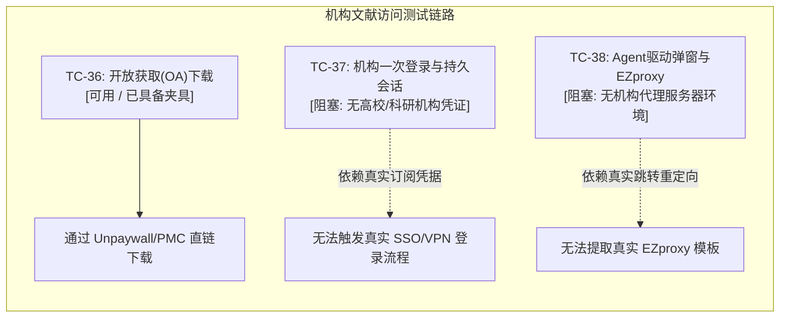

# Drone 科研模拟测试脱敏夹具与大文件规范指南

> **文档版本**：v1.0.0  
> **更新时间**：2026-10-09  
> **适用范围**：覆盖全量历史 PR 模拟用户测试规范（`docs/simulated-user-testing-plan.md`），重点支撑 CAT-07（生信分析与专业可视化）、CAT-05（文献调研与机构访问）与 CAT-06（科研探索与血缘追溯）场景。

---

## 1. 建设背景与核心目标

在 Drone 模拟用户测试规约体系（PR #1–#97，63 项核心测试用例）中，科研计算与学术闭环相关用例对测试数据的专业性、规范性以及安全性提出了严苛要求：
- **生信大文件整读拦截（TC-50）**：验证系统在面对大于 4 MiB 的大型基因组比对（BAM）、变异检测（VCF）或高通量测序读段（FASTQ）时，能够严格触发防溢出熔断并给出专业工具预览命令行，防止大文件阻塞主进程。
- **生信专业查看器渲染（TC-52）**：验证系统发育树（Newick / IQ-TREE）以及多序列比对（FASTA / Clustal / PHYLIP）解析器在复杂拓扑、枝长分化年代与 Bootstrap 支持率下的渲染鲁棒性。
- **交互式离线科研图表（TC-53）**：验证内嵌科研报告在无外网依赖且受到严格内容安全策略（CSP，`connect-src 'none'`）约束的沙箱中，仍可流畅提供缩放、悬浮提示和分类过滤等交互能力。

为此，本项目通过测试机 `YoungWeMbp` 的现有 SSH Key 免密连通测试服务器 `10.126.126.4`，对真实科研工作区进行只读勘查，整理出这套涵盖真实文件登记、本地公开脱敏样本以及动态大文件合成器的标准夹具库。

### 1.1 安全合规边界与设计原则
1. **零凭证泄露**：不读取、不打印、不提交任何 SSH 私钥、密码或 API Key 凭证。
2. **服务器原始数据只读**：对 `10.126.126.4` 上的原始生物数据与工作流输出保持严格只读，不修改、不污染服务器文件。
3. **敏感基因组数据脱敏隔离**：真实服务器上的数十 GB 未发表基因组、Hi-C 与高通量测序大文件严禁上传至 Git 仓库，仅登记其服务器绝对路径与技术规格；本地自动化测试通过脚本动态生成结构合规的脱敏大文件，并通过 `.gitignore` 排除。
4. **离线沙箱零外部外联**：所有科研图形与 HTML 报告夹具均自包含，不引用外部 CDN，严格遵守 Electron 沙箱 CSP 规则。

---

## 2. 测试服务器（10.126.126.4）大文件夹具勘查记录

### 2.1 服务器节点与环境信息
- **主机地址**：`10.126.126.4`（主机名 `dell`）
- **操作用户**：`gaoyangwei`
- **系统环境**：CentOS Linux 7 (Linux 3.10.0-1160.71.1.el7.x86_64)
- **勘查根目录**：`/Data/Liuxingyue/home/gaoyangwei/`

### 2.2 真实大文件勘查登记表
在测试服务器的基因组组装与基因家族分析工作区中，勘查到以下典型大文件。由于其体积巨大（GB 级别）且属于未发表的私有科研组学数据，本清单仅做元数据归档，**严禁提交入库**：

| 文件类型 | 服务器绝对路径 | 文件大小 | 数据特征与格式规范 | 安全与脱敏策略 |
|---|---|---|---|---|
| **BAM (短读/HiFi 比对)** | `/Data/Liuxingyue/home/gaoyangwei/03_Projects/01_genome_assembly/Nipponeurorthus_ningboensis/step2_blodtools/aligned.sorted.bam` | **23 GiB** | PacBio HiFi 比对至重叠群的坐标排序二进制 BAM 文件，带完整索引与 Header | 包含私有基因组原始组装比对；**不入库**，本地通过生成器合成 >4.5 MiB 脱敏 BAM 验证 TC-50 |
| **BAM (Hi-C 染色体构象)** | `/Data/Liuxingyue/home/gaoyangwei/03_Projects/01_genome_assembly/Bubopsis_tancrei/step6_haphic/HiC.filtered.bam` | **32 GiB** | Hi-C 过滤后成对交互比对数据，超大二进制索引流 | 包含未发表物种三维基因组数据；**不入库**，仅归档路径供实机远程计算环境验证 |
| **FASTQ (测序读段)** | `/Data/Liuxingyue/home/gaoyangwei/02_Project/05_genefamily/followup_20260926/F3_hifi/BRA.chr/chr1.fq.gz` | **94 MiB** (压缩) | 单染色体提取的高质量 PacBio HiFi 测序 reads，四行标准 FASTQ 结构 | 包含未发表基因组原始序列；**不入库**，本地保留 48B 公开 reads 并通过脚本动态扩充 |
| **CRAM (高压缩比对)** | `/Data/Liuxingyue/home/gaoyangwei/02_Project/05_genefamily/followup_20260926/F3_hifi/BRA.hifi.cram` | **3.8 GiB** | 依赖参考基因组的 CRAM 压缩格式比对文件 | 包含私有组学数据；**不入库** |
| **HTML (Nextflow 报告)** | `/Data/Liuxingyue/home/gaoyangwei/03_Projects/01_genome_assembly/Nipponeurorthus_ningboensis/step2_blodtools/local/pipeline_info/blobtoolkit/execution_report_2025-09-23_03-00-14.html` | **2.4 MiB** | Nextflow 组装流水线执行摘要，内嵌离线 Plotly.js v1.34.0 图表 | 离线自包含 HTML，作为 TC-53 交互式图表的设计蓝本，提取脱敏离线火山图模板供测试使用 |

---

## 3. 本地脱敏/公开科研夹具清单与校验信息

本地夹具已组织至 `test/fixtures/simulated-user/` 目录下，所有样本均经过严格清洗，去除所有敏感注释与私有序列信息，采用公开/合成基线。

### 3.1 完整夹具文件明细与 SHA-256 校验清单

| 相对路径 | 分类 | 格式 | 尺寸 | 来源与规范说明 | SHA-256 校验和 |
|---|---|---|---|---|---|
| `test/fixtures/simulated-user/tree/species_tree.nwk` | 进化树 | Newick | 64 B | 真实物种分化时间树（4叶物种，含时间尺度枝长：`120.5`, `253.51` 等） | `9d8d56f715a5979b90d1d6a2993f149c0299f0452676a3426182b5159f1e8c5a` |
| `test/fixtures/simulated-user/tree/tree_with_support.treefile` | 进化树 | IQ-TREE | 1.1 KiB | 真实 19 物种系统发育树，包含 IQ-TREE Ultrafast Bootstrap 支持率（如 `100/100`） | `13dc7bb2770941025675c255dee71d719918a3e53660d3289fef80eab6def403` |
| `test/fixtures/simulated-user/tree/synthetic_tree.nwk` | 进化树 | Newick | 31 B | 标准合成 Newick 拓扑结构：`((A:0.1,B:0.2):0.3,(C:0.4,D:0.5):0.6);` | `ce0743f4569159f865fbad96f68c29bd022818be32fd0e4201bbd392e23a8ba3` |
| `test/fixtures/simulated-user/alignment/alignment.aln` | 多序列比对 | FASTA/ALN | 46 KiB | 真实 19 条基因家族长序列比对，长度 1098 bp，含保守结构域及 Gap 缺失符号 `-` | `8cbf26e1f83caaafbd169bdc56e05fcf57927945cd580fef1b721a6d882b807e` |
| `test/fixtures/simulated-user/alignment/alignment.phy` | 多序列比对 | PHYLIP | 177 KiB | 真实 111 物种直系同源蛋白比对，标准 PHYLIP interleaved/sequential 格式 | `9be7ec214846a340df7a45276aeb002b8cb75af44eafbadb69c9a227cd8770c3` |
| `test/fixtures/simulated-user/alignment/alignment_clustal.aln` | 多序列比对 | Clustal | 847 B | 标准 ClustalW 格式比对文本，含头信息 `CLUSTAL W (1.83)` 与保守位点符号 `*` | `92d444fd6f28e0fd650c7af19f3d0bf1aa047cc530df7a357f3206c84feb842b` |
| `test/fixtures/simulated-user/alignment/paired-default.fasta` | 多序列比对 | FASTA | 5.1 KiB | 18 条规范 FASTA 序列（长度 254 bp），源自 QIIME 2 BSD-3-Clause 公开测试集 | `48a096b1263df7d2ed7c3c08784f3303818c8ebd72fa7504d7b82ab349dcc3aa` |
| `test/fixtures/simulated-user/variants/clean.vcf` | 变异信息 | VCF v4.2 | 143 B | 合成标准 VCF 4.2 格式文件，包含常规单核苷酸多态性（SNP）与等位基因注释 | `07b54f8bc7000c01084aae0618d3631819a5f42e472e0425036aa82a56a13e73` |
| `test/fixtures/simulated-user/variants/grch38.vcf` | 变异信息 | VCF v4.2 | 117 B | GRCh38 参考基因组坐标标准变异格式，带 `chr1` 标准染色体命名前缀 | `b8ba9d2a0d5b43b49bedd415f36fae13a7979888f94944ac3dde983b439e55fa` |
| `test/fixtures/simulated-user/variants/variants.vcf` | 变异信息 | VCF v4.2 | 229 B | 包含结构变异（SV）说明标记 `SVTYPE=DEL` 与 `SVLEN=-100` 的复杂变异行 | `12d5b939b7a28235d99d6d20df5d3e55067183ec4e84f0c3c9899f6e34491926` |
| `test/fixtures/simulated-user/reads/reads.fastq` | 测序读段 | FASTQ | 48 B | 标准 Illumina 四行结构测序片段，包含 `@` 标识符、序列、`+` 与质量字符 | `df6ecc6cb5e4670fbcf87423ba7d42fea444ab2c4f9901ed545fc5a3496a078d` |
| `test/fixtures/simulated-user/reads/sample-metadata.tsv` | 元数据 | TSV | 277 B | QIIME 2 标准样本元数据表格，含 `#SampleID`、条形码、处理组标签等信息 | `a7d780f536669a16018b3dbc8635c6bf4b5882bf3e2c583f6028a660634498fe` |
| `test/fixtures/simulated-user/reads/provenance.json` | 来源血缘 | JSON | 3.0 KiB | QIIME 2 分析工件完整 DAG 执行来源与环境回执（对应 TC-44 产物血缘追溯） | `e6dd4e0ceba886247c7ea71c08b7308eeeda7a0c8d29122891e9dd57a4071eeb` |
| `test/fixtures/simulated-user/reads/QIIME2_LICENSE` | 开源许可 | 文本 | 1.5 KiB | 对应 QIIME 2 测试数据 BSD 3-Clause 许可证正文，保障合法学术引用合规 | `10fbb1ad8c44bca07e0ff24a4c5a932e675b31b46a2a095ee8cf4414bc9dc8b1` |
| `test/fixtures/simulated-user/reports/report_interactive.html` | 离线科研图形 | HTML/SVG | 11 KiB | 自包含交互式转录组火山图（Volcano Plot），支持放大/缩小/复位、悬浮数据气泡、显著性分类筛选，完全零外网请求 | `5cc22487b9ab5e295ec30516724e66655f4a496ef4a1e9a25b8d2e82c268621f` |

---

## 4. 可运行方式与模拟测试场景映射

### 4.1 动态大文件测试夹具生成脚本
由于真实生物大文件（>4 MiB）禁止直接提交入库，项目提供了专用的动态生成脚本 [`scripts/generate-simulated-fixtures.mjs`](../scripts/generate-simulated-fixtures.mjs)。
该脚本可以在测试准备阶段快速生成超过 4.5 MiB 的合成样本：

```bash
# 默认生成至 test/fixtures/simulated-user/generated/（已被 .gitignore 自动忽略）
node scripts/generate-simulated-fixtures.mjs

# 或指定临时目录生成
node scripts/generate-simulated-fixtures.mjs /tmp/test-large-fixtures
```

生成的文件列表：
- `sample_oversized.bam`（4.50 MB，携带合规 BAM Header 的二进制大文件）
- `sample_oversized.vcf`（4.50 MB，携带标准元数据的大批量变异位点文件）
- `sample_oversized.fastq`（4.50 MB，海量 Illumina 读段）
- `sample_oversized.fq.gz`（9.55 MB 原始大小的压缩读段）

### 4.2 场景映射与断言规约

| 模拟测试场景 | 所用夹具文件 | 核心执行与验证逻辑 | 预期通过标准 |
|---|---|---|---|
| **TC-50: 生信大文件保护拦截** | `sample_oversized.bam`<br>`sample_oversized.vcf`<br>`sample_oversized.fastq` | 后端工具扩展层 `packages/backend/src/tools/bio/extension.ts` 中的 `largeBioFileReason` 对目标文件进行大小检测 | 1. 检测到文件大于 4 MiB 立即拦截，返回阻断原因。<br>2. BAM 文件给出推荐指令：`samtools view -H`。<br>3. VCF 文件给出推荐指令：`bcftools view -h`。<br>4. FASTQ 文件给出推荐指令：`seqkit stats`。 |
| **TC-52: 生信树与比对查看器** | `species_tree.nwk`<br>`tree_with_support.treefile`<br>`synthetic_tree.nwk`<br>`alignment.aln`<br>`alignment.phy` | `@drone/shared` 的 `parseNewick`、`layoutTree`、`alignmentPreview` 函数解析输入流并完成坐标布局 | 1. `species_tree.nwk` 准确识别 4 个物种叶片节点与枝长分化深度（~253.51）。<br>2. `tree_with_support.treefile` 准确提取 19 个物种叶片及 `100` 支持率标签。<br>3. 比对解析器准确识别 FASTA（19条）、Clustal（4条）、PHYLIP（111条）三类格式，无解析异常。 |
| **TC-53: 离线交互式科研图表** | `report_interactive.html` | 在 Electron 渲染沙箱中加载，开启 `connect-src 'none'` CSP 规则 | 1. 页面完全内嵌 CSS 与原生 SVG/JS，无任何 `http://` 或 `https://` 外部外联。<br>2. 缩放按钮、复位按钮、悬浮气泡、显著性分类筛选交互流畅，不触发 CSP 拦截报错。 |
| **TC-44: 产物来源卡与重跑血缘** | `reads/provenance.json`<br>`reads/sample-metadata.tsv` | 模拟科研工作流将产物血缘 DAG 与元数据沉淀至 Inquiry 账本 | 能够完整还原软件版本、执行参数、输入工件 SHA-256 哈希及父级依赖关系。 |

### 4.3 自动化测试运行指令

通过预置的集成测试套件可一键验证全部夹具解析与大文件防护机制：

```bash
# 运行夹具与大文件拦截自动化测试
npm run test:unit -w @drone/backend -- -t "simulated user"
```

---

## 5. 机构登录用例（TC-37 / TC-38）阻塞状态声明

在模拟用户测试规约中，文献调研与机构访问分类（CAT-05）下的两项关键用例由于外部环境与凭证依赖，明确声明为**阻塞状态**：



### 5.1 阻塞用例详情

| 用例编号 | 用例名称 | 核心需求 | 对应 PR | 当前状态 | 阻塞根因说明 |
|---|---|---|---|---|---|
| **TC-37** | **机构访问一次登录与持久会话** | 用户在 Electron 专用窗口完成高校/研究所机构认证（Shibboleth / CARSI / WebVPN），系统将 Cookie 加密持久化并在后续静默请求文献正文。 | PR #38 | **【阻塞 / Blocked】** | 需真实高校或科研机构的合法文献库订阅账号与统一身份认证（SSO）凭证。测试服务器 `10.126.126.4` 仅为本地 Linux 计算集群，不提供也不托管机构文献库代理凭证；测试环境不得且无法提供真实个人或单位学号/密码。 |
| **TC-38** | **Agent 驱动弹窗与 EZproxy 模板自动提取** | Agent 下载收费文献触发机构权限弹窗，用户完成登录后，系统自动分析登录跳转路径，自动提取并保存机构的 EZproxy 代理模板。 | PR #39 | **【阻塞 / Blocked】** | 依赖真实的商业数据库提供商（如 Elsevier / Springer / Wiley）与机构 EZproxy 网关的重定向 URL 模式。缺乏真实代理服务器与拦截页面，无法在端到端链路中真实触发并断言模板提取逻辑。 |

### 5.2 安全与审计红线
- 严禁将开发人员或任何用户的真实机构账号、密码、个人 Cookie 硬编码或提交至仓库与测试夹具中。
- 测试过程中若需验证该逻辑，严禁向外部生产认证端点发起撞库或高频探测请求。

### 5.3 未来解阻条件与备选方案
当后续测试环境具备以下条件之一时，可解除上述阻塞标记：
1. **本地 Mock 机构网关（推荐）**：在本地搭建轻量级基于 Docker 的 Mock Shibboleth / EZproxy 登录测试服务，模拟标准的 SAML 2.0 / CAS 重定向跳转与 Set-Cookie 响应头，在零真实凭证的前提下完成 TC-37 / TC-38 链路闭环。
2. **测试专用沙箱 Token**：由机构管理员通过平台 Team Secrets 注入短期专用的沙箱测试会话 Cookie，仅供单次 CI 任务消费，过期自动失效。
