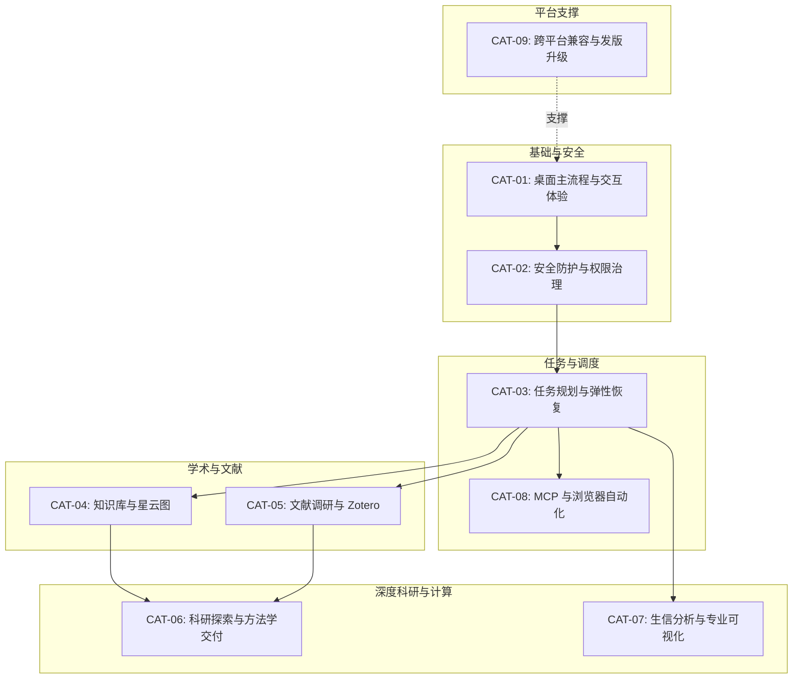

# Drone 基于全量历史 PR 的模拟用户测试分类与执行规约

> **文档版本**：v1.0.0  
> **制定日期**：2026-10-09  
> **适用基线**：Drone v0.24.0（HEAD @ PR #97）  
> **文档定位**：基于 Drone 仓库自初始版本至今的**全部历史 PR（PR #1–#97，含 88 个合并 PR 及早期版本关键 commit #3–#11）**，以实际代码改动与用户可见行为为唯一事实来源，设计的系统性模拟用户测试分类、场景规约与下一阶段实施路线图。

---

## 1. 规划目标与设计原则

### 1.1 规划背景与核心目标
Drone 经过数十个版本的密集迭代，沉淀了涵盖 Electron 桌面主壳、任务规划与状态机、知识图谱网络、Zotero 文献闭环、OpenScience 科学严谨性框架、生信分析与远程计算等多个垂直领域的复杂能力。传统的单元测试和静态契约检查虽然能够保证单一函数和 IPC 通道类型的正确性，但在面对真实用户的跨模块、多回合交互时，容易遗漏诸如：**状态遮挡、权限打断、并发锁竞争、图谱卡顿、外部网络风控拦截、长会话上下文溢出**等关键体验断点。

本规划的目标是：
1. **全景覆盖**：彻底通读并覆盖仓库所有可检索的历史 PR，不留测试死角。
2. **用户旅程为纲**：以真实科研工作者/日常使用者的任务目标与操作心智为组织维度，拒绝按文件结构或 PR 编号机械堆砌。
3. **严谨事实支撑**：每条用例的预期行为、界面反馈与异常分支均直接源自 PR 的实际代码实现和事故复盘（不凭空捏造；尚未完全联通或需要特定外部环境的标为【待核实/需特定环境】）。
4. **自动化与人工双就绪**：定义清晰的前置条件、操作序列与断言点，既可作为发版前人工点测指南，也可直接转化为基于 CDP（Chrome DevTools Protocol）和真实 Electron 实例的端到端自动化测试脚本。

### 1.2 分类架构演化与依据
在原始需求建议的 7 大场景基础上，本规划结合代码实际演进与用户心智模型，调整为 **9 大核心模拟用户场景体系**：

| 调整项 | 原始建议范围 | 调整后分类 | 调整依据说明 |
|---|---|---|---|
| **调整一：独立安全与权限** | 归在桌面主流程或任务中 | **分类二：安全防护、项目信任与权限治理** | Drone 拥有独特的零信任防御纵深（项目信任弹窗、多根工作区、读写分离、高危命令拦截、配置文件自保护、一次性任务授权）。将其独立，使安全合规基线边界清晰（覆盖 #1, #3, #9, #10, #12, #30, #37）。 |
| **调整二：解耦 Zotero 与浏览器 MCP** | 合并为 MCP/浏览器/Zotero | **分类五：文献调研、Zotero 与机构访问** **分类八：MCP 生态与浏览器智能体** | Zotero 与机构访问属于“严肃文献证据链”（依赖 DOI、PDF 解析、Cookie 会话与元数据同步）；而浏览器 MCP（Chrome 接管、人机验证）属于“开放网络探索与外设工具”。两者的前置环境、操作模式与风控边界截然不同，解耦更利于独立构造测试夹具。 |

---

## 2. 全量历史 PR 覆盖率总表与映射索引

本规划覆盖仓库检索到的全部 88 个 GitHub PR，以及历史提交记录中登记的 9 项关键早期功能（编号 #3–#11）。总覆盖率达 **100%（97/97）**：

| 分类编号 | 测试分类名称 | 包含的 PR / 历史提交列表 | 涵盖的核心能力与用户可见改动 |
|---|---|---|---|
| **CAT-01** | **桌面主流程与交互体验** | #4, #6, #8, #9, #11, #12, #15, #27, #32, #53, #54, #67, #69, #72, #84, #87 | 启动闪屏、多会话顶栏胶囊与拖拽排序、Composer 行内技能胶囊与补全定位、@子代理唤醒、运行状态动画流内占位（不遮挡对话）、中英语言一致性、LAN 局域网观察双态切换。 |
| **CAT-02** | **安全防护、项目信任与权限治理** | #1, #3, #9, #10, #12, #30, #37 | 项目首次打开信任弹窗、多根工作区边界（roots）、读写分离审批（读放行/写确认）、链式/嵌套危险 Bash 命令拦截、敏感文件自保护防篡改、全局 `permissions.json` 可视化编辑与规则试算、一次性任务授权。 |
| **CAT-03** | **任务规划、路由调度与弹性恢复** | #21, #22, #23, #24, #29, #31, #35, #37, #41, #42, #52, #70, #75, #76, #79, #83, #92, #94, #95 | 六大方向内置示例任务一键发起、显式任务规划卡片（`task_plan`）、并发无锁状态对账（`task_reconcile` 防碰撞）、任务路由过程看板（11个阶段列）、紧凑路线图与导图视图、按能力路由技能与限额、累计 3 次失败熔断、上下文蒸发与 Todo 恢复。 |
| **CAT-04** | **知识库构建、图增强检索与闭环网络** | #13, #14, #16, #55, #60, #61, #81, #82, #85, #88, #96, #97 | 本地优先检索指引（本地库→联网）、双向链接与出链/反链 1 跳图扩展检索、星云知识网络图（WebGL/ForceAtlas2/Louvain）、知识图 UI 重设计（语义视图/镜像合并/节点卡片）、知识入库标准（I1: 9条分类规则/frontmatter; I2: 统一项目身份解析）、Wiki 提案审核闭环、每日新知发现、防失控循环熔断。 |
| **CAT-05** | **文献调研、Zotero 与机构网络访问** | #17, #26, #34, #36, #38, #39, #73, #74 | Zotero 独立 UI 面板与启用开关、Zotero 10 本地写场景（新建条目/分类归档/上传本地 PDF）、Zotero 网页 API 凭证管理与环境变量注入（`ZOTERO_API_KEY`）、单复数库类型兼容、DOI 开放获取解析（Unpaywall/PMC）、机构访问（EZproxy/Shibboleth 一次性登录与模板自动保存）。 |
| **CAT-06** | **科研探索、严谨评估与方法学交付** | #40, #44, #45, #46, #47, #48, #51, #56, #59, #66, #71 | 回答模式切换（`/answer-mode quick\|academic\|auto`）、学术回答结构规范与“可能被忽略的点”、`/发现`（`/discover`）自我质疑探索、后台交付物独立审稿人（Background Reviewer）、科研五本账（Inquiry Ledgers）、产物来源卡（Provenance）与重跑、可撤销决策账本、Methods 研究方法学确认落盘。 |
| **CAT-07** | **生信分析、远程计算与专业可视化** | #62, #63, #64, #65, #80 | `bio_db` 公共数据库只读检索（NCBI/GEO/UniProt/Ensembl/SRA）、执行位置选择（`/run-on local\|<host>\|auto`）、`bio_environment` 软硬件探测与远程环境复用、大生物数据文件保护拦截（>4MiB BAM/VCF/FASTQ 禁整读）、系统发育树与多序列比对渲染、交互式 HTML 图表渲染与用户可标注图反传。 |
| **CAT-08** | **MCP 生态与浏览器智能体** | #58, #86, #91 | 安装包内置 `pi-mcp-adapter` 5.1.0、MCP 配置规范（`enabled: false` 显式禁用）、浏览器控制预设（接管本机 Chrome 实例、独立 Profile 保持免密登录、Cloudflare 人机验证手动交接）。 |
| **CAT-09** | **跨平台兼容、发版打包与客户端升级** | #2, #5, #7, #18, #19, #20, #25, #28, #33, #43, #49, #50, #57, #68, #77, #78, #89, #90, #93 | 跨平台终端抹平（非 Windows 隐藏 powershell、统一 Node/sh 调度）、Windows 专项适配（NSIS 安装/SQLite 正常关闭/UTF-8 字符集/测试超时调整）、Linux 发行包、关于页检查更新与下载流、发版打包流水线完整性（pi-packages 预 Stage/大文件断点续传/非商业授权隔离/多平台并行构建）。 |

---

## 3. 九大模拟用户测试分类与详细场景规约

---

### 分类一：桌面主流程与交互体验（Desktop Core & Interaction Lifecycle）

#### 1. 用户目标
用户能够在日常启动应用、管理多个并行任务会话、在输入框编辑指令、观看模型输出与状态动画、切换中英语言、以及通过局域网多端观察执行状态时，获得流畅、无视觉遮挡、无状态错乱的桌面交互体验。

#### 2. 前置条件
- 已安装并启动 Drone 桌面客户端（macOS / Windows / Linux）。
- 配置有可用 Provider（或使用测试隔离的 faux provider）。

#### 3. 详细操作步骤与核心场景
- **场景 TC-01：启动闪屏与优雅退出**
  1. 冷启动 Drone 应用，观察启动过程。
  2. 验证粒子群闪屏动画正常渲染，并在应用主界面加载就绪后产生波纹扩散效果并平滑退出（#4）。
  3. 观察应用标题栏及品牌名称正确展示为“Drone”（历史更名演进 #8）。
- **场景 TC-02：多会话管理与顶栏胶囊标签交互**
  1. 点击“+”新建多个会话，发送不同领域的首条消息。
  2. 观察顶栏标签胶囊自动生成首行语义摘要作为标题（#9, #15）。
  3. 鼠标长按并拖拽顶栏会话胶囊，模拟浏览器标签页重排次序，释放后位置即刻更新并持久化（#11）。
  4. 切换不同会话，验证会话间历史消息、流式状态和输入框草稿完全隔离。
- **场景 TC-03：Composer 输入框技能胶囊行内化与精准定位**
  1. 在输入框键入 `/`，观察斜杠命令与技能补全弹窗出现，位置严格锚定在输入框上方（#84）。
  2. 键盘上下键选中任一技能（如 `/skill:academic-paper`）并按回车。
  3. 验证输入框中技能呈现为行内 Token 胶囊（无突兀黑底阴影，字体字号与正文自然对齐），并在继续键入提示词时保持流式排版（#84）。
  4. 在消息开头键入 `@`，验证 `@` 补全菜单准确弹出并列出当前会话可用的子智能体列表（头像+描述+状态），支持快速选择直达派发（#32）。
- **场景 TC-04：流式正文贴底与中央状态动画不遮挡对话**
  1. 发送长篇幅回答请求，观察消息流式渲染过程。
  2. 验证正文滚动容器自动保持贴底（tail-follow）；当用户主动向上滚动时，自动暂停贴底并保留位置（#67, #72）。
  3. 观察执行期间的中央放大状态动画（CenterOrb），验证动画在正文流内作为内联占位呈现，绝不悬浮覆盖正在生成的文字（解决 Windows 严重遮挡缺陷 #69, #84）。
  4. 工具调用或子代理执行时，状态行显示实时活动指示器扫光动效（#6, #9）。
- **场景 TC-05：中英文双语一致性与 Windows UTF-8 同步**
  1. 打开设置，在语言选项中由“中文”切换为“English”（#87）。
  2. 验证所有界面组件（按钮、占位符、错误提示、系统提示语）全部即时刷新为英文，无漏翻词条。
  3. 后端生成指令时，环境变量 `DRONE_REPLY_LANGUAGE` 同步刷新，模型回复及宿主插入提示语言严格匹配设置。
  4. 在 Windows 终端环境测试命令执行，验证终端输入输出强制生效 UTF-8 编码，消除中文乱码（#87）。
- **场景 TC-06：局域网观察页（LAN Observer）只读与远控二态**
  1. 进入设置开启“局域网观察”（LAN Observer），移动设备扫描二维码或访问给定 URL。
  2. 默认模式（只读）：验证移动端实时接收 SSE 消息流，界面隐藏 Composer 输入框与权限审批按钮，仅能观察（#12, #53）。
  3. 开启“允许远程控制”第二开关：验证移动端恢复 Composer 输入框，可发送补充追问并对弹出的权限请求进行审批（#53）。
- **场景 TC-07：UI 插件持久化与扩展钩子生命周期**
  1. 开启任一 UI 插件（如任务侧栏增强插件），重启应用。
  2. 验证插件启用状态在 deep-merge 后依然生效，覆盖层正常加载（#12, #27）。

#### 4. 预期可见结果
- 粒子闪屏无白屏闪烁；顶栏标签支持平滑拖拽重排；自动命名准确。
- Composer 输入框中的技能标记与文字自然融合，补全菜单无位移偏差。
- 回答生成时文字清晰可读，无悬浮遮罩压盖；中英文切换彻底。
- 局域网观察端实时流式同步，读写权限控制严格。

#### 5. 失败/边界路径
- **边界 1（超长标题截断）**：用户首条消息包含上千字提示词，验证顶栏胶囊按首行取前 24 字符并优雅 ellipsis 截断，不挤出视口。
- **边界 2（快速高频切换会话）**：连续快速点击不同标签，验证 trace 录制器与状态流正确释放旧会话句柄，不发生渲染卡死或内存泄漏。
- **边界 3（网络断开重连）**：LAN 客户端网络闪断，验证 SSE 自动重连且数据帧不错位。

#### 6. 涉及 PR 事实来源
- PR #4: `feat: splash screen with particle swarm and ripple exit`
- PR #6: `feat: live activity indicator during tool/subagent execution`
- PR #8: `chore: rename project to Percho (subsequently Drone)`
- PR #9: `状态行扫光重做 + 自定义 Provider 编辑 + 项目信任前置 + UI 细节`
- PR #11: `feat: 顶栏会话胶囊拖拽排序（浏览器标签式）`
- PR #12: `fix: v0.7.0 majors — write approvals, plugin persist, ask hang`
- PR #15: `Deepen modules: 6 architecture refactors on v0.7.2`
- PR #27: `refactor(hooks): replace hardcoded tool/skill/acceptance tables with extension-declared hooks`
- PR #32: `feat(composer): @ subagent selector dispatches straight to the session`
- PR #53: `release: v0.19.2 hotfix — 恢复 LAN 远程控制双态`
- PR #54: `feat(ui): trim redundant entry points per refocus plan`
- PR #67: `fix: 发版前实机测试发现的问题（会话切换、滚动跟随、界面润色）`
- PR #69: `fix: 中央动画运行期盖住对话文字`
- PR #72: `fix: small follow-ups from the functional test pass on f838418`
- PR #84: `fix(composer): / 技能胶囊对齐与行内化、补全菜单锚定输入框；放大状态动画不再覆盖对话`
- PR #87: `feat(i18n): 语言一致性——界面语言同步后端、回复语言规则、宿主文案双语、补齐中文词条、Windows UTF-8`

---

### 分类二：安全防护、项目信任与权限治理（Security, Project Trust & Permission Governance）

#### 1. 用户目标
用户在使用 Drone 访问本地代码、打开陌生仓库或授权 Agent 执行系统工具时，能够得到零信任前置防护、敏感配置文件防篡改、链式危险命令拦截、可视化权限规则治理，以及“一次授权即可完整跑完受信任任务”的安全与效率平衡。

#### 2. 前置条件
- 应用运行在干净工作空间，准备一个未受信任的本地测试目录。
- 准备包含高危 Bash 命令（如 `rm -rf /` 或复合管道命令）的测试场景。

#### 3. 详细操作步骤与核心场景
- **场景 TC-08：首次打开目录的项目信任前置决策**
  1. 打开一个包含外部脚本或 `.pi/` 扩展的新目录。
  2. 验证在执行任何命令或加载项目扩展前，主界面弹出前置信任确认弹窗（#9）。
  3. 选择“不信任”：验证仅允许只读查看，不加载项目本地私有扩展，不执行项目钩子。
  4. 选择“信任此项目”：验证选择写入 `~/.pi/agent/trust.json`，后续打开静默加载。
- **场景 TC-09：工作区多根边界（roots）与读写分离授权**
  1. 在会话中让 Agent 读取项目外部公共文件（如 `/etc/hosts` 或用户指定的参考目录）。
  2. 验证基于多根配置（`workspaces.json` 的 `roots[]`），合法多根边界内的读取操作默认自动放行，无需用户点击确认（#10, #12）。
  3. 当 Agent 尝试对项目外部目录执行 `write` / `edit` 时，审批底栏（Approval Dock）强制挂起并高亮提示请求写出边界，等待用户审批（#12）。
- **场景 TC-10：链式/嵌套高危 Bash 命令拦截与自保护模式**
  1. 诱导 Agent 执行复合危险命令（如 `cat foo.txt && rm -rf /`，或 `find . -name "*.tmp" -exec rm {} +`）。
  2. 验证权限引擎的 `evaluateBashCommand` 对命令链切片并按最严段判定，命中 deny 规则时坚决阻断（#3, #12）。
  3. Agent 尝试读取或篡改核心凭据与安全文件（`auth.json`、`trust.json`、`permissions.json`、`workspaces.json`）。
  4. 验证触发系统自保护规则（`PERMISSION_SELF_PROTECTION_PATTERNS`），无论规则库如何配置，直接拒绝写入（#10, #30）。
- **场景 TC-11：设置页可视化管理全局 `permissions.json` 与规则实时试算**
  1. 打开设置对话框中的“权限”面板（#30）。
  2. 页面清晰列出：工作区边界开关（外部读/写、系统临时区豁免）、工具规则列表、Bash 模式规则表。
  3. 对规则执行上移、下移、删除或新增一条自定义匹配模式。
  4. 在页面底部的“规则试算”（probe）中输入模拟命令（如 `git push origin main`），验证实时返回计算出的决策（allow/ask/deny）与命中的规则来源（#30）。
  5. 点击保存，验证新规则立即生效，无需重启应用。
- **场景 TC-12：同一毫秒规则重写的热重载防护**
  1. 模拟自动化脚本或并发测试在同一毫秒内连续重写 `permissions.json`。
  2. 验证 `createPermissionConfigLoader` 同时比对文件 `mtimeMs` 与 `size`，准确感知内容变更并刷新内存规则树，绝不回退至未定义状态（#1）。
- **场景 TC-13：任务级一次性授权（One Authorization）与安全执行续作**
  1. 启动一个需要多步副作用（如写文件、跑测试、归档）的复杂任务。
  2. 在任务卡片弹出后，用户点击一次“同意本次请求”（One Authorization）（#37）。
  3. 验证在此后的连续多轮副作用执行中，受限在任务申报白名单内的工具调用自动执行，不再频繁弹出权限确认弹窗或需要用户反复回复“继续”（#12, #37）。

#### 4. 预期可见结果
- 首次打开外部项目有明确的信任拦截；敏感配置文件绝对受控。
- 权限设置页操作直观，试算结果准确；复合链式危险命令被彻底拆解防御。
- 一次授权后任务流畅自动推进，无无效审批弹窗打断。

#### 5. 失败/边界路径
- **边界 1（越权路径伪装）**：尝试通过符号链接（symlink）或相对路径穿透（`../../`）绕过多根工作区，验证被 realpath 规范化后拦截。
- **边界 2（权限文件格式损坏）**：手动故意破坏 `permissions.json` 为非法 JSON，验证后端通过 `JsonStore` 抛出结构化错误，自动加载默认安全配置并阻断写覆盖，保证系统不崩溃。

#### 6. 涉及 PR 事实来源
- PR #1: `fix(permissions): reload rules after same-ms permissions.json rewrite`
- PR #3: `fix: permission gate catches chained/wrapped dangerous commands, add project boundary (0.1.3)`
- PR #9: `状态行扫光重做 + 自定义 Provider 编辑 + 项目信任前置 + UI 细节`
- PR #10: `feat: 权限系统升级——工作区多根 + 读写分离 + 记忆持久化`
- PR #12: `fix: v0.7.0 majors — write approvals, plugin persist, ask hang, knowledge loop`
- PR #30: `feat(settings): permissions panel editing the global permissions.json`
- PR #37: `feat(tasks): one authorization runs an example task to completion`

---

### 分类三：任务规划、路由调度与弹性恢复（Task Planning, Capability Routing & Resilience）

#### 1. 用户目标
用户能够一键发起标准科研/工程任务，或提出自由复杂需求；系统通过显式任务规划分解步骤，在路线图与过程看板上实时同步进度，在遭遇环境波动或工具连续失败时自动熔断并寻找替代路径，并在长回合交互中利用上下文蒸发维持系统轻盈稳定。

#### 2. 前置条件
- 工作区具备标准项目结构，配置可用 LLM 模型。
- 包含内置六大方向示例任务（数据分析、文献证据、生信流程、代码开发等）。

#### 3. 详细操作步骤与核心场景
- **场景 TC-14：内置六大方向示例任务一键发起与校验**
  1. 打开空会话，查看示例任务入口（卡片视图 / 斜杠菜单行）（#29）。
  2. 点击任一示例任务（如“文献证据工作流”或“小菜蛾基因分析”），弹出启动对话框。
  3. 检查任务输入项：若缺少必须参数（如 DOI 或输入文件），界面明确提示缺口；参数就绪后一键点击发起（#29）。
  4. 验证系统生成规范首条指令，自然唤醒 `task_plan`，不使用黑盒私有提示词（#29）。
- **场景 TC-15：显式任务规划（`task_plan`）与通用检查点续跑**
  1. Agent 分析需求后调用 `task_plan`，界面渲染结构化任务看板卡片（里程碑、验收标准、预算上限）（#21, #24）。
  2. 用户审查计划并授权后，任务状态进入执行态；各里程碑按序推进（#21, #23）。
  3. 当会话异常中断或用户关闭窗口后重新打开，系统根据持久化任务检查点安全恢复进度，无需从头重跑（#21, #35）。
- **场景 TC-16：高并发无锁状态对账（`task_reconcile` 并发版本保护）**
  1. 模拟多步骤任务执行时，底层连续触发工具副作用与状态更新（`set_status`）。
  2. 验证任务对账器执行 `task_reconcile` 时，能够平滑兼容并行的 `book.revision` 递增，绝不因并发版本号变化抛出 `stale-task-view` 阻断执行（根治长会话卡死事故 #92）。
- **场景 TC-17：任务路由过程看板（11个阶段列流转与阻塞标记）**
  1. 打开任务路由过程看板（#95）。
  2. 验证看板清晰展示 Todos 体系的 11 个标准阶段列（todo, queued, planning, confirm, plan_reviewing, building, review, implement_reviewing, done, failed, closed）。
  3. 观察任务卡片随执行进度在各列之间平滑移动；当任务因权限等待或人工确认挂起时，卡片高亮显示阻塞标记（blocked badge）（#95）。
- **场景 TC-18：紧凑路线图（`turnRouteSteps`）与思维导图视图**
  1. 在单轮对话中，Agent 分解多阶段操作。
  2. 观察界面紧凑路线图组件（Roadmap），清晰显示“用户意图 → 能力装载 → 主技能调用 → 结果落地”的紧凑步骤链（#83）。
  3. 点击切换至 React Flow 思维导图视图，验证节点布局与依赖分支关系直观呈现，支持缩放与拖拽（#83）。
- **场景 TC-19：按能力路由技能与限额控制（Capability-Scoped Routing）**
  1. 发起特定领域任务（例如生信序列比对）。
  2. 验证系统按能力范围装载技能（如生信能力仅暴露生信与通用工具，隔离无关技能）（#76, #78）。
  3. 检查技能上限控制机制：严格遵守技能数量限额，主技能优先装载，生信关键工具全覆盖，防止上下文被过多技能膨胀撑爆（#79）。
- **场景 TC-20：同一失败特征累计 3 次阈值熔断与重定向决策**
  1. 构造一个持续报错的场景（例如调用一个参数不合规的工具，连续返回相同签名错误）。
  2. 第一次与第二次失败：系统记录失败特征并尝试自我纠偏（#94）。
  3. 累计达到第三次失败：熔断机制（circuit-break guard）强制拦截下一次相同调用，并生成重定向决策，提示 Agent 更换策略或向用户求助（#94）。
  4. 验证当 Agent 修正参数或换用新工具后，熔断成功解除并恢复执行（#94）。
- **场景 TC-21：子智能体面板派发、运行跟踪与审批归因**
  1. 在右侧面板打开“子智能体”页签，查看可用 Agent 列表（#31）。
  2. 手动派发一个专用子智能体（如 scout 或 research 专家）执行子任务。
  3. 观察子智能体槽位排队、独立会话运行卡与实时事件收流；子智能体发起的权限请求在审批底栏中清晰标注派发来源归因（#31）。
- **场景 TC-22：状态链闭环、上下文蒸发与 Todo 恢复提醒**
  1. 在长达数十轮的复杂探索会话中，验证内置上下文蒸发扩展（Context Evaporation）自动将早期大体积工具输出转换为紧凑 stub，保全 KV Cache（#42, #70）。
  2. 会话因网络波动断开重连时，上下文钩子自动注入 `todo-reminder`，引导模型无缝接续未完成计划（#200 机制验证）。

#### 4. 预期可见结果
- 任务卡片从创建、审批、流转到完成全生命周期状态明确；看板 11 列映射精准。
- 路线图与思维导图动态响应当前轮次目标；技能按能力严格裁剪。
- 重复错误在第 3 次被确定性拦截；长会话无版本冲突卡死与内存崩溃。

#### 5. 失败/边界路径
- **边界 1（不可变计划被篡改）**：当当前任务处于执行中且包含不可变计划时，若模型尝试非法重写计划，验证系统自动创建分立的新任务而非直接破坏原计划（#24）。
- **边界 2（多次熔断后恢复）**：从持久化快照恢复一个已熔断的任务，验证熔断状态保持有效；只有在输入新指令或调整参数后才重新放行（#94）。

#### 6. 涉及 PR 事实来源
- PR #21: `feat: generic task checkpoints and safe continuation (v0.7.8)`
- PR #22: `Fix task ask_user authorization and improve reviewed task delivery UI`
- PR #23: `release: Drone v0.10.2 task authorization and workbench fixes`
- PR #24: `fix: finalize explicit task planning and release v0.10.3`
- PR #29: `feat(examples): six built-in example tasks (panel cards, slash-menu rows, launch dialog)`
- PR #31: `feat(subagents): session-scoped subagent panel (dispatch, runs, avatars, approval attribution)`
- PR #35: `fix(capabilities): keep the capability checkpoint while an approved task is in progress`
- PR #37: `feat(tasks): one authorization runs an example task to completion`
- PR #41: `Integrate turn-route panel and recovered-failure handling (closed/superseded by #52)`
- PR #42: `fix: close drone research task state chain`
- PR #52: `feat(chat): turn route and decision cards`
- PR #70: `fix: issues found in a functional test pass after v0.20.0 / #69`
- PR #75: `feat: port remaining turn-route / architecture-v2 features onto main`
- PR #76: `feat: 按能力路由技能 / capability-scoped skill routing`
- PR #79: `fix: 能力路由 v0.21.1（~/.agents 技能分组限额、主技能优先、生信全覆盖、里程碑 ID）`
- PR #83: `feat(route): 每轮路由改为紧凑路线图，可选导图视图`
- PR #92: `Latency, knowledge retrieval and browser preset improvements (task_reconcile concurrent fix)`
- PR #94: `失败熔断机制评估与实现 (3次同一失败特征拦截)`
- PR #95: `设计任务路由的过程看板 (11个阶段列)`

---

### 分类四：知识库构建、图增强检索与闭环网络（Knowledge Vault, Graph Retrieval & Knowledge Loop）

#### 1. 用户目标
用户能够利用本地 Markdown 知识库沉淀科研灵感与实验笔记；在检索时优先获取本地高置信度知识并借助图关系扩展上下文；在知识网络中直观浏览节点群落、镜像关系与结构健康度；规范入库分类并高效完成 Wiki 提案审核与每日新知发现。

#### 2. 前置条件
- 本地配置有 Vault 目录，预置一批包含 Wiki 链接（`[[link]]`）、分类 frontmatter 的笔记和论文记录。

#### 3. 详细操作步骤与核心场景
- **场景 TC-23：本地优先知识检索循环（Local-First Guidance）**
  1. 向 Agent 提出一个在本地知识库中已有沉淀的科学问题。
  2. 观察 Agent 检索策略：每轮严格遵循“本地优先引导（Local-First Guidance）”，首先通过 `research_search_knowledge` 检索本地 Vault（#55）。
  3. 仅当本地知识覆盖不足或明确需要外部新信息时，才向外发起网络检索，杜绝滥用外部网络（#55）。
- **场景 TC-24：双向链接与出链/反链 1 跳图增强检索**
  1. Agent 调用 `research_read_knowledge` 读取某篇核心概念笔记。
  2. 验证返回的首个数据块中直接内联携带该节点的一跳出链（links）与反链（backlinks）（各最多 12 条），Agent 无需发起额外的邻居探测检索即可获知关联上下文（#61, #81, #92）。
  3. 搜索结果中剥离冗余的内部调试分数，文本摘要紧凑压缩在 700 字符内，降低延迟与上下文开销（#92）。
- **场景 TC-25：星云式知识网络图 WebGL/SVG 渲染与聚类布局**
  1. 打开知识库面板的“知识网络图”（#82, #96）。
  2. 默认模式下通过 SVG 清晰渲染网络骨架；切换到 WebGL 星云模式（基于 Sigma.js v3 + Graphology），验证大规模节点在 Web Worker 中通过 ForceAtlas2 算法流畅收敛布局，无主线程掉帧卡顿（#82）。
  3. 观察 Louvain 社区聚类算法为不同研究子领域的节点簇赋予区分明显的星云色彩（#82）。
- **场景 TC-26：知识网络图 UI 重设计：语义视图、镜像合并与信息卡片**
  1. 在网络图顶部工具栏切换“语义视图”与“全部文件视图”（#96）。
  2. 开启“镜像合并”开关：验证同一论文的多种格式镜像（如 `.md` 与对应资源）自动聚合为单实体节点，避免图扑膨胀（#96）。
  3. 观察图谱健康检查标签（chips）：显示孤立节点计数、循环引用与未解析链接（#96）。
  4. 点击任一节点：验证仅产生选中高亮并联动展开右侧节点信息卡（展示出反链、跳数和健康警告），绝不自动产生意外跳转；点击卡片上的“打开笔记”按钮才执行正文跳转（#96）。
- **场景 TC-27：知识入库标准 I1（9条分类规则与 frontmatter 规范）**
  1. 让 Agent 沉淀一份分析笔记（调用入库逻辑）。
  2. 验证分类器严格按照 I1 标准的 9 条规则进行分流判定：永久知识（paper/software/method/idea）入库、临时中间产物归入运行结果归档、临时草稿不予保留（#85）。
  3. 验证生成的 Markdown 文件 frontmatter 符合受限规范模式，包含规范化标识符（DOI / PMID / arXiv）、去重键及结论哈希（#85）。
- **场景 TC-28：知识入库标准 I2（统一项目身份解析）**
  1. 在没有显式传递 `project` 参数的日常会话中发起知识沉淀。
  2. 验证项目解析器严格根据统一身份规则（当前工作区 `knowledgeProjectId` 或目录哈希派生）锁定项目范围，彻底废除旧版回落至公共 `research-workbench` 的混乱逻辑（#88）。
- **场景 TC-29：Wiki 提案审核闭环（自动应用 vs 人工审核）**
  1. Agent 提议新增一份知识卡片。
  2. 自动应用模式：若为全新页面或纯 Agent 生成的历史页面，直接原子写入 Vault 并发出轻量通知（#12, #14）。
  3. 人工审核模式：若页面曾被用户手动修改过，自动判定为冲突敏感，生成待审核提案并推送到 Wiki 审核队列，由用户显式 Diff 对比后批准（#12, #14）。
- **场景 TC-30：每日新知发现（Daily Discovery）与空结果解释**
  1. 触发每日知识发现检查任务（每天主动分析近 24 小时新增笔记）（#60）。
  2. 若发现跨文献的潜在新交叉点，生成构想卡片（idea）供用户查阅（#60）。
  3. 若过去 24 小时无新增笔记或未产生足够置信度的新连结，界面给出友好、明确的说明文案，避免生成空卡片造成困惑（#71）。
- **场景 TC-31：知识门控异常暴露与失控循环熔断**
  1. 模拟底层 LLM 在知识检索中遭遇 401/429 错误，验证知识门控直接透传真实 LLM 错误卡，绝不掩盖为“知识库未初始化”（#13）。
  2. 当知识检索工具陷入死循环互调时，熔断机制（circuit-break）在阈值达到时强制刹车（#16）。

#### 4. 预期可见结果
- 检索遵循“本地优先”；单次读取直接内嵌出反链；知识图 WebGL/SVG 渲染丝滑。
- 网络图节点点击交互稳定，右侧卡片信息丰富；镜像文件有效合并。
- 入库标准规范统一；Wiki 冲突有保护；每日发现无静默失败。

#### 5. 失败/边界路径
- **边界 1（超大规模复杂网络卡顿）**：导入数千篇笔记的测试 Vault，验证 Web Worker 异步计算布局，主线程交互响应时间不超过 50ms。
- **边界 2（文件损坏或语法错误的 frontmatter）**：Vault 中存在语法畸变的文件，验证 I1 解析器优雅跳过或给出警告标记，不中断整体图谱构建。

#### 6. 涉及 PR 事实来源
- PR #13: `fix: stop knowledge gate from masking LLM provider errors`
- PR #14: `fix: start initialization model handoff immediately`
- PR #16: `Fix: circuit-break runaway knowledge tool-loops`
- PR #55: `feat(knowledge): close the local-first knowledge loop`
- PR #60: `feat(knowledge): daily discovery — new ideas from knowledge updates`
- PR #61: `feat(knowledge): bidirectional links, knowledge network and auto-linking`
- PR #81: `feat(knowledge): 图增强检索（1 跳出链/反链扩展）`
- PR #82: `feat(knowledge): 星云式知识网络（sigma.js v3 + graphology）`
- PR #85: `feat(knowledge): 知识入库标准 I1——分类器、frontmatter 模式与标识符规范化`
- PR #88: `feat(knowledge): 知识入库标准 I2——统一项目身份解析，移除 research-workbench 默认项目`
- PR #96: `知识网络图 UI 重设计 (语义视图、镜像合并、聚焦交互、节点卡片)`
- PR #97: `chore(knowledge): regenerate knowledge runtime artifacts (fix CI)`

---

### 分类五：文献调研、Zotero 与机构网络访问（Literature Research, Zotero Integration & Institutional Access）

#### 1. 用户目标
用户在开展学术调研时，能够与本地或云端 Zotero 无缝联动管理文献库，自动从开放获取源下载合法 PDF，并在拥有高校/科研院所订阅时通过安全合规的机构访问网关（EZproxy 等）实现一次登录即可静默自动下载闭源全文。

#### 2. 前置条件
- 本地安装有 Zotero 客户端或已配置 Zotero Web API 凭证。
- 准备包含合法 Open Access DOI（如 PMC / arXiv）及机构订阅 DOI 的测试样本。

#### 3. 详细操作步骤与核心场景
- **场景 TC-32：Zotero 专属 UI 面板与启用状态同步**
  1. 在桌面侧边栏展开 Zotero 面板（#17）。
  2. 验证 Zotero 拥有完全独立的 UI 入口与开关控制，彻底解绑早期与 Obsidian Vault 的混杂配置（#17）。
  3. 切换启用/停用开关，观察当前连接状态与本地文献条目统计即时同步。
- **场景 TC-33：Zotero 10 本地写场景与已有条目归类/挂 PDF**
  1. 要求 Agent 调研特定主题并沉淀到 Zotero。
  2. Agent 执行 `research_zotero_save` 创建新文献条目（元数据、作者、年份、DOI）。
  3. Agent 执行 `research_zotero_update`：将已有条目归入用户指定的分类文件夹（collection），或为已有条目挂载本地已下载的全文 PDF 附件（#69, #74）。
  4. 验证操作完成后向用户生成明确的 Zotero 操作回执，回执正常发布并沉淀到过程记录中，不因知识库校验抛出异常（#73）。
- **场景 TC-34：Zotero 网页 API 凭证与单复数库类型兼容**
  1. 在设置中配置 Zotero 网页 API 密钥与用户库/群组库（#91）。
  2. 验证底层注入环境变量时，库类型严格规范为单数形式（`user` / `group`），完全兼容 pyzotero 协议，而在外部请求 URL 中正确转换为复数（`users` / `groups`）（#91）。
- **场景 TC-35：任务执行中动态识别 DOI 与用户确认重绑机制**
  1. 发起一个文献调研任务，任务规划时尚未知晓确切 DOI。
  2. 当 Agent 检索到文献并写入 Zotero 后，验收器挂钩（`identify` 钩子）自动从运行时回执中提取有效 DOI 并动态绑定到里程碑验收项中（#34）。
  3. 若模型推测的 DOI 与后续事实不符，系统提示用户进行确认，经用户确认后原子修正并重绑有效 DOI（#34）。
- **场景 TC-36：合法开放获取（Open Access）PDF 自动解析与归档**
  1. 给定一个具有开放获取权限的 DOI（如 PMC 文章）。
  2. Agent 调用 `research_archive_source` 归档来源文献。
  3. 验证系统通过合法 OA 路由（Unpaywall / Europe PMC）自动解析直链并下载 PDF 正文，杜绝模型随机伪造不可达链接（#36）。
- **场景 TC-37：机构访问（Institutional Access）一次登录与持久会话【当前阻塞 / Blocked：缺少真实机构订阅凭据】**
  > ⚠️ **阻塞声明**：本用例依赖真实高校或科研院所统一身份认证（SAML/Shibboleth/CAS/CARSI）与订阅权限，测试服务器（`10.126.126.4`）与本地测试环境无可用凭证，目前明确标记为**阻塞状态**（详见 [`docs/research-test-fixtures.md`](research-test-fixtures.md)）。
  1. 用户开启机构访问设置（支持 EZproxy / Shibboleth / CARSI / OpenAthens / WebVPN）（#38）。
  2. 触发一次机构认证：系统弹出受控的专用 Electron 登录窗口，用户完成统一身份认证（#38）。
  3. 验证登录成功的 Cookie 会话被加密持久化到安全配置中；在后续任务执行中，Agent 自动利用该合法持久凭证请求文献正文，不再重复弹窗打扰（#38）。
- **场景 TC-38：Agent 驱动的机构访问弹窗与 EZproxy 模板自动提取【当前阻塞 / Blocked：缺少真实机构订阅凭据】**
  > ⚠️ **阻塞声明**：依赖真实商业数据库与高校 EZproxy 代理重定向链条，无合规外部代理凭证环境，目前明确标记为**阻塞状态**（详见 [`docs/research-test-fixtures.md`](research-test-fixtures.md)）。
  1. 当 Agent 在静默下载文献时遇到机构权限要求，Agent 主动发起机构访问请求（#39）。
  2. 登录窗口弹出并引导用户登录；用户登录完成后，系统自动分析登录跳转路径，自动提取并保存机构的 EZproxy 代理模板，无需用户手动编写正则表达式配置（#39）。
- **场景 TC-39：文献证据链完整回执与来源审查**
  1. 任务完成后，查看生成的文献调研交付物。
  2. 验证交付物附带严谨的来源回执（包括实际下载路径、文件哈希、来源平台与授权模式），清晰表明证据可复核性（#26）。

#### 4. 预期可见结果
- Zotero 面板独立可控，本地与 Web API 交互稳定。
- Zotero 条目新建、分类归类、PDF 上传全链条通畅且产生可追溯回执。
- 开放获取与机构订阅文献能够自动合法下载，EZproxy 模板免配置提取。

#### 5. 失败/边界路径
- **边界 1（机构会话过期）**：模拟持久化 Cookie 失效，验证 Agent 下载失败时不会死循环重试，而是生成 `institutional_auth_required` 状态，提示用户重新打开登录窗口。
- **边界 2（闭源且无机构订阅）**：文献既无 OA 开放版本且不在机构订阅范围内，验证系统诚实记录证据缺口，不使用盗版破解源下载。

#### 6. 涉及 PR 事实来源
- PR #17: `Zotero: dedicated UI panel + enable toggle; untangle from Obsidian setup`
- PR #26: `feat: improve research evidence workflow and user guidance`
- PR #34: `feat(tasks): bind zotero_item DOIs at runtime and rebind wrong DOIs with user confirmation`
- PR #36: `feat(research): resolve legitimate open-access PDFs for research_archive_source from a DOI`
- PR #38: `feat(institutional): one-time institutional login with persistent session and auto-download`
- PR #39: `feat(institutional): auto-save EZproxy template on login, agent-requested login`
- PR #73: `fix(knowledge): publish Zotero receipts instead of failing the knowledge check`
- PR #74: `feat(zotero): Zotero 10 local writes + reconcile desktop-saved items`
- PR #91: `fix(mcp,zotero): Pi 格式用 enabled:false 停用 MCP；Zotero 库类型注入单数形式`

---

### 分类六：科研探索、严谨评估与方法学交付（Scientific Inquiry, Discovery & Harness Evaluation）

#### 1. 用户目标
用户在开展高水平学术探索与论文撰写时，能够根据需要自由切换快速回答与学术严谨回答；利用自我质疑发现潜在研究盲区；依靠后台审稿人把关交付物质量；依托可追溯的科研五本账与产物来源卡进行复现实验，并确保决策可撤销、Methods 方法学规范经确认后写入。

#### 2. 前置条件
- 已开启 OpenScience 科学智能体 Harness 机制（默认启用）。
- 工作区包含实验数据（如 CSV、脚本及预处理结果）。

#### 3. 详细操作步骤与核心场景
- **场景 TC-40：回答模式切换（`/answer-mode quick | academic | auto`）与学术回答规范**
  1. 在会话中使用命令切换回答模式：`/answer-mode academic`（#56）。
  2. 向 Agent 咨询科学问题，观察其生成的回答结构：严格遵循学术回答合同，结论先行、论证严密、附带证据与局限性说明（#56）。
  3. 切换为 `/answer-mode quick`，验证针对简单问题的回复变得精炼敏捷，去除非必要的长篇学术铺垫（#56）。
- **场景 TC-41：学术回答“可能被忽略的点”与 `/发现`（`/discover`）自我质疑**
  1. 在学术回答的末尾，验证系统按规则自动输出“可能被忽略的点”（`OVERLOOKED_POINTS_RULE`），提示潜在混杂因素、反例或替代假说（#59）。
  2. 键入 `/发现`（或 `/discover`）命令，启动自主发散与自我质疑模式（#59）。
  3. 观察 Agent 启动独立批评逻辑（Critic），对现有研究思路进行新颖性、严谨性和可检验性推敲，生成最多 3 条高价值探索构想并通过弹窗卡片由用户决策是否采纳（#59）。
- **场景 TC-42：后台交付物独立审稿人（Background Reviewer）实时把关**
  1. 当任务生成关键交付物（如分析报告或数据表格）时，后台自动触发只读审稿人任务（#46）。
  2. 审稿人不改变文件正文、不污染主对话，仅通过结构化事件在过程看板中给出审稿评级（如是否缺少统计检验、是否存在数字与图表不一致）（#46）。
  3. 若发现关键瑕疵，界面呈现警告徽章并提醒用户关注（#46）。
- **场景 TC-43：科研状态层（Inquiry）五本账与项目隔离持久化**
  1. 打开研究状态面板，查看当前项目的科研账本（#40, #51）。
  2. 验证五本账完整清晰：产物账本（Artifacts）、发现账本（Findings）、问题/假设账本（Hypotheses）、分析尝试账本（Attempts）、Agent 决策账本（Decisions）（#40）。
  3. 切换到另一个本地项目，验证各项目的 SQLite Inquiry 账本完全隔离，无跨项目数据串扰（#51）。
- **场景 TC-44：产物来源卡（Artifact Provenance Cards）与可复现重跑**
  1. 在交付物列表中点击任一产物卡片，展开“产物来源卡”（Provenance Card）（#47）。
  2. 来源卡清晰追溯其父级血缘（最多 20 层父链）、生成会话与回合、代码指纹以及输入数据的 SHA-256 哈希（#47）。
  3. 点击“可复现重跑（Reproducible Rerun）”，验证系统能够以相同的依赖环境和参数重新发起计算检验（#47）。
- **场景 TC-45：可撤销 Agent 决策账本（Revocable Decision Ledger）闭环**
  1. 在决策账本面板中查看 Agent 此前自主或经授权做出的关键决策（如参数选择、工作流自动修复、数据清洗规则）（#48）。
  2. 用户对某项决策点击“撤销（Revoke）”，输入撤销理由。
  3. 验证系统将该决策及其下游产物状态置为 `pending-review`，若用户随后尝试发布该产物，发布流程被强制拦截并提示需重新确认（#48）。
  4. 用户重新点击“确认放行（Confirm）”后，拦截解除并恢复发布权限（#48）。
- **场景 TC-46：Methods 方法学事实提炼与用户确认原子写入**
  1. 数据分析任务执行完毕，需要形成实验方法学说明。
  2. Agent 调用 `research_methods` 扩展工具（#66）。
  3. 系统首先严格从运行记录中提取客观事实（输入输出哈希、软件版本、声明参数、执行回执），基于事实草拟 Methods 段落（#66）。
  4. 界面弹出用户确认卡片，展示草拟的正文与事实对比；只有在用户显式点击确认后，才原子写入 `<run>/METHODS.md`，杜绝模型私自篡改（#66）。
- **场景 TC-47：宿主契约强校验与异常拒绝机制**
  1. 模拟插件或异常调用向宿主传递不符合 TypeBox 契约的数据结构。
  2. 验证宿主契约层明确拒绝并抛出结构化验证错误，绝不静默接受脏数据（#71）。

#### 4. 预期可见结果
- 回答模式切换灵敏有效；学术回答自带严谨质疑；审稿人提供中立评估。
- 科研五本账清晰记录每一步推演；产物来源卡血缘完整；决策撤销逻辑闭环。
- Methods 严格遵循“事实支撑 + 用户确认后落盘”。

#### 5. 失败/边界路径
- **边界 1（血缘环检测）**：人为构造相互引用的产物血缘环，验证 Lineage 校验器抛出循环错误并阻止脏记录入库。
- **边界 2（数据篡改告警）**：若产物对应的底层输入文件被外部程序篡改，来源卡显示 `untraceable-number` 或哈希不匹配警告。

#### 6. 涉及 PR 事实来源
- PR #40: `feat: merge architecture v2 follow-up`
- PR #44: `feat: ship OpenScience-inspired agent harness in v0.18.0`
- PR #45: `feat(harness): add independent unit switches and trigger traces`
- PR #46: `feat(reviewer): add background deliverable review`
- PR #47: `feat(artifacts): add provenance cards and reproducible reruns`
- PR #48: `feat(decisions): add revocable decision ledger`
- PR #51: `release: v0.19.1 (fix desktop inquiry ledgers by canonical workspace identity)`
- PR #56: `feat(answers): quick / academic answer modes`
- PR #59: `feat(discovery): /发现 command and "possibly overlooked" points`
- PR #66: `feat(research): Methods 段——按运行记录起草，用户确认后才写入`
- PR #71: `fix: test-report follow-ups — reject contract validation errors, explain empty daily discovery, i18n`

---

### 分类七：生信分析、远程计算与专业可视化（Bioinformatics, Remote Compute & Visual Inspection）

#### 1. 用户目标
生物信息学与计算生物学研究者能够在桌面端直接检索公共生物数据库、灵活指定或由 Agent 自动判定任务在本地或远程服务器运行、获得大生物数据文件的防溢出安全保护、监控远程 Nextflow/Slurm 流程，并直接在桌面预览进化树、多序列比对和交互式图表。

#### 2. 前置条件
- 配置有本地生物分析工具链，或注册有远程 SSH 计算主机。
- 准备测试生信文件：Newick 进化树文件、Clustal/FASTA 多序列比对文件、>4MiB BAM 文件、Plotly 交互 HTML。

#### 3. 详细操作步骤与核心场景
- **场景 TC-48：`bio_db` 公共数据库只读检索**
  1. 要求 Agent 查询特定基因或序列数据。
  2. Agent 调用 `bio_db` 工具检索公共库：
     - NCBI GEO 数据集元数据与样本表
     - UniProtKB 蛋白质结构与功能注释
     - Ensembl 基因坐标与释出版本
     - ENA / SRA 测序 Run 信息（直接获取 FASTQ 官方下载 URL 与 MD5 校验和）（#63）。
  3. 验证检索走固定官方端点，附带串行限速保护，结果末尾附带可复核的检索源 URL（#63）。
- **场景 TC-49：执行位置选择（`/run-on local | <host> | auto`）与环境自动探测**
  1. 使用命令设定执行位置：`/run-on auto`，或显式指定 `/run-on remote-slurm`（#62）。
  2. Agent 自动调用 `bio_environment` 探测目标机器环境：检测已安装的生信工具（samtools, blast, fastqc）、conda 环境、Docker/Singularity 容器运行时以及 CPU/内存/磁盘配额（#62）。
  3. 验证本地探测免人工审批；远程探测脚本经过 SSH 提交并附带安全审查（#62）。
- **场景 TC-50：大生物数据文件读取保护拦截（>4MiB 拦截规则）**
  1. Agent 尝试使用通用文件读取工具读取一个 50MB 的 BAM 文件、VCF 文件或 FASTQ 文件。
  2. 验证内置大文件防护扩展（`makeBioExtension`）直接拦截整读操作（#62）。
  3. 工具调用返回明确拦截说明：“文件大于 4 MiB，禁止全文读入上下文”，并给出适合该格式的命令行预览建议（如 `samtools view -h sample.bam | head -n 20`）（#62）。
- **场景 TC-51：远程环境注册表登记与跨会话复用**
  1. 远程主机环境探测成功后，其配置与环境摘要被登记在环境注册表中（#80）。
  2. 在后续新会话中针对同一主机发起计算任务时，系统直接复用已验证的环境清单，避免每次重复探测浪费时间（#80）。
- **场景 TC-52：结果查看器：系统发育树（Newick）与多序列比对（MSA）渲染**
  1. 任务生成 `.nwk` / `.tree` 系统发育树文件。
  2. 在侧边栏资源预览区点击该文件，验证结果查看器自动激活树状图渲染组件，支持节点缩放、展开/收起分支（#64）。
  3. 任务生成 `.aln` / `.fasta` 多序列比对文件。
  4. 在查看器中打开，验证呈现彩色残基比对视图（Clustal 色彩体系），支持横向同步滚动与一致性序列标记（#64）。
- **场景 TC-53：结果查看器：交互式 HTML 图表渲染与用户可标注图反传**
  1. 任务生成基于 Plotly 或 Bokeh 的交互式 HTML 分析报告（#65）。
  2. 查看器中打开 HTML 预览，点击“运行交互内容”开关，验证复杂图表的缩放、悬浮提示和图例切换正常运行（#65）。
  3. 对于静态结果图（如差异表达火山图），用户可在查看器中启用“图像标注”工具，在关键数据点上圈选并添加标注文字（如“关注此离群基因”）（#65）。
  4. 点击“将标注发送给 Agent”，验证标注截图与坐标信息作为新消息自动发回当前会话，Agent 针对标注区域开展深度解读（#65）。

#### 4. 预期可见结果
- 公共数据库检索迅速且携带 MD5；环境探测准确定位工具链。
- 大文件整读被百分之百拦截并给出预览建议，杜绝上下文爆炸崩溃。
- 系统发育树、MSA 与交互式 HTML 在桌面端原生美观呈现；图表标注顺畅发回 Agent。

#### 5. 失败/边界路径
- **边界 1（远程 SSH 连接超时或凭证失效）**：模拟远程计算节点不可达，验证系统平滑报错并退回本地评估或提示重新配置，不导致主界面假死。
- **边界 2（损坏的 Newick 树文件）**：文件括号不闭合或语法错误，验证查看器显示友好语法解析错误提示，并支持回退到纯文本视图。

#### 6. 涉及 PR 事实来源
- PR #62: `feat(bio): 执行位置选择、环境探测、大文件保护、数据集笔记`
- PR #63: `feat(bio): bio_db 公共数据库只读检索`
- PR #64: `feat(viewer): 结果查看器支持系统发育树与多序列比对`
- PR #65: `feat(viewer): 交互式 HTML 图 + 可标注图（标注发回 Agent）`
- PR #80: `feat(bio): 平台感知、环境注册表与远程环境复用 (stacked on #79)`

---

### 分类八：MCP 生态与浏览器智能体（MCP Ecosystem & Browser Automation）

#### 1. 用户目标
用户能够利用系统内置打包的 MCP 适配器开箱即用扩展工具能力，安全配置工具启用状态，并驱动浏览器智能体接管已安装的 Chrome 执行自动化网页检索与数据抓取，在遭遇网站反爬验证码时由人工无缝接管完成验证。

#### 2. 前置条件
- 宿主机已安装 Google Chrome 浏览器。
- 打包安装包包含内置 `pi-mcp-adapter`（版本 5.1.0）。

#### 3. 详细操作步骤与核心场景
- **场景 TC-54：安装包内置 `pi-mcp-adapter` 5.1.0 运行时加载**
  1. 在全新机器（未全局安装任何 node 工具）上安装 Drone。
  2. 启动会话并加载任意标准 MCP 服务器（如本地文件或外部 API）。
  3. 验证应用内部直接使用安装包内置打包的 `pi-mcp-adapter 5.1.0` 驱动协议通信，无需用户在系统环境中 `npm i -g`，彻底消除运行时加载丢失问题（#86）。
- **场景 TC-55：MCP 配置规范（`enabled: false` 显式禁用与容错）**
  1. 打开用户级或项目级 `mcp.json` 配置文件。
  2. 将某 MCP 服务配置为 `"enabled": false`。
  3. 验证底层适配器正确识别并停用该工具服务；同时对历史遗留的 `"disabled": true` 语法保持容错兼容，不发生配置解析失败（#91）。
- **场景 TC-56：浏览器预设接管本机 Chrome 实例与持久化 Profile 免密浏览**
  1. Agent 需要使用浏览器执行网页探索（启动预设浏览器 MCP）（#58, #86, #92）。
  2. 验证浏览器预设自动探测并调用系统已安装的 Google Chrome 可执行文件（使用 `--browser chrome` 选项）（#92）。
  3. 验证浏览器运行在专门分配的持久化用户数据目录中：用户在此前已登录的网站状态（Cookies / 登录会话）得以保留，Agent 访问时直接处于登录态，无需重复输入账号密码（#92）。
- **场景 TC-57：Cloudflare / 人机验证挑战的人工交接（Human Handoff）**
  1. 浏览器访问受到 Cloudflare 或高风控验证码拦截的学术/公开网站。
  2. 系统检测到 Cloudflare 拦截特征（如 `cf-mitigated`、`challenge-platform` 或 `Just a moment` 标题）（#93）。
  3. 宿主立即向用户弹出人机交接卡片（zh/en 双语），明确说明：“遇到网站安全验证，请在浏览器中手动完成验证”（#93）。
  4. 用户在弹出的 Chrome 窗口中完成滑块验证或点击验证码。
  5. 用户在卡片上点击“继续（Continue）”：系统通知 Agent 重新读取已通过验证的页面；若用户点击“跳过（Skip）”，任务优雅记录 `browser_required` 状态并不视作证据造假（#93）。

#### 4. 预期可见结果
- 内置 MCP 适配器零配置可用，配置语法容错性高。
- Chrome 实例启动迅速，用户登录凭证稳定继承。
- 遇反爬验证码不卡死、不暴力破解，人机协作卡片交互顺畅。

#### 5. 失败/边界路径
- **边界 1（本地未安装 Chrome）**：系统找不到 Chrome 路径，验证浏览器工具给出明确提示：“未检测到兼容的 Chrome 安装，请安装 Chrome 或检查路径设置”，不产生未捕获异常。
- **边界 2（验证超时）**：弹出人机接管卡片后用户长时间未操作，验证卡片支持安全关闭，并返回受控错误。

#### 6. 涉及 PR 事实来源
- PR #58: `feat(remote): browser-control MCP preset and SSH host registry for the agent`
- PR #86: `feat(mcp): 安装包内置 pi-mcp-adapter 5.1.0，修复浏览器 MCP 加载链路`
- PR #91: `fix(mcp,zotero): Pi 格式用 enabled:false 停用 MCP；Zotero 库类型注入单数形式；更新示例配置`
- PR #92: `Latency, knowledge retrieval and browser preset improvements (本机 Chrome 预设与持久化说明)`
- PR #93: `跨平台移除 powershell 工具与 Cloudflare 接管 (拦截检测与人机交接卡片)`

---

### 分类九：跨平台兼容、发版打包与客户端升级（Cross-Platform Parity, Packaging & Auto-Update）

#### 1. 用户目标
用户在 macOS（Apple Silicon / Intel）、Windows（x64 / ARM）以及 Linux 各种桌面发行版下，均能下载开箱即用的安装包，享受一致的功能特性与控制台交互，并在新版本释出时通过关于页自动检测并完成安全更新。

#### 2. 前置条件
- 具备 macOS、Windows、Linux 测试系统环境（或对应 CI 虚拟机）。
- 构建产物包含 DMG、ZIP、NSIS Exe、AppImage / deb。

#### 3. 详细操作步骤与核心场景
- **场景 TC-58：跨平台终端工具抹平（非 Windows 移除 powershell 依赖）**
  1. 在 macOS 和 Linux 客户端中打开 Drone。
  2. 检查系统注册的内置工具列表，验证 `powershell` 工具被彻底隐藏，执行环境统一收敛至标准 POSIX sh / bash（#93）。
  3. 在 Windows 客户端中验证 `powershell` 正确放置在 `coding` 技能包中供本地脚本调度（#93）。
- **场景 TC-59：Windows 平台深度适配（SQLite 正常退出与 UTF-8 控制台）**
  1. 在 Windows 11 环境中运行包含本地 SQLite Inquiry 账本操作的任务。
  2. 退出应用时，验证 SQLite 数据库连接被严格按序关闭，不产生文件锁残留或进程挂死（#20）。
  3. 执行命令行任务，输出中文字符串，验证通过强制 UTF-8 修复，控制台输出完全无乱码（#87）。
  4. 验证测试套件中 Windows 磁盘 I/O 较慢的问题已通过合理的超时放宽得到保护，CI 无偶发假红（#43, #57）。
- **场景 TC-60：Linux 桌面包打包与安装验证**
  1. 在 Ubuntu / Debian 环境下运行打包的 AppImage 与 deb 格式安装包（#2）。
  2. 验证应用能够正常启动、创建窗口，托盘与通知机制运行正常。
- **场景 TC-61：关于页检查更新、静默下载与手动安装降级**
  1. 打开“关于”页面，点击“检查更新”（#18）。
  2. 当远端有新版本（如 v0.24.0）释出时，界面显示新版本更新日志与进度条，并在后台安全下载（#18）。
  3. 若遇到未签名 macOS 安装包无法自动覆盖的情况，界面优雅提示手动下载 fallback 链接或指引通过 Homebrew Tap 安装（#5）。
- **场景 TC-62：发版打包流水线与资源依赖预 Stage 健全性**
  1. 验证 GitHub Actions Release 工作流已升级为三平台并行构建模式（macOS / Windows / Linux 并行），大幅缩短发版耗时（#77）。
  2. 验证打包脚本在执行打包前强制预先执行 `stage pi-packages`，杜绝因外部依赖未打包导致 Release 失败的事故（#90）。
  3. 验证大尺寸发布资产上传机制，超时阈值放宽，支持大型安装包稳定上传 GitHub Release（#25）。
  4. 验证学术资源包（如 ARS pack）在开源与发版时严格遵守 CC BY-NC 4.0 非商业授权隔离（#28）。
- **场景 TC-63：全量功能回归测试基线验证**
  1. 基于 CDP 驱动真实 Electron 实例进行 P1–P5 端到端实机模拟点测（#50, #67, #70）。
  2. 验证 Renderer Console 错误数为 0、未捕获 Promise Rejection 为 0，无无限渲染死循环。

#### 4. 预期可见结果
- 跨平台行为高度一致；Windows 控制台无乱码；非 Windows 无 PowerShell 干扰。
- 安装包完整封装内置依赖；检查更新与下载流程顺畅。
- CI 并行发版流水线稳固，资源协议合规。

#### 5. 失败/边界路径
- **边界 1（网络代理中断下载更新）**：在下载更新包途中人为切断网络，验证关于页显示“下载失败，请重试或前往官网下载”，不产生死锁状态。
- **边界 2（文件损坏的 DMG 挂载）**：若下载的 DMG 文件哈希损坏，验证更新程序检测哈希不符并拒绝执行挂载，提示重新获取（复盘 #50 事故）。

#### 6. 涉及 PR 事实来源
- PR #2: `feat(desktop): add Linux x64 AppImage and deb release artifacts`
- PR #5: `feat: homebrew tap + manual-install fallback for unsigned mac builds`
- PR #7: `ci: refresh website via Cloudflare Pages deploy hook on release`
- PR #18: `fix: download available desktop updates`
- PR #19: `fix: repair knowledge indexing and Windows workflows`
- PR #20: `fix: finish Windows suite and SQLite shutdown (v0.7.7)`
- PR #25: `ci: allow large release asset uploads to finish`
- PR #28: `fix(release): ship the ARS pack under its CC BY-NC 4.0 noncommercial grant`
- PR #33: `chore: prepare v0.11.0 release`
- PR #43: `test: prevent Windows release timeout`
- PR #49: `release: v0.19.0`
- PR #50: `test: v0.19 simulated user UI and performance report`
- PR #57: `test: raise vitest timeouts on Windows runners`
- PR #68: `release: v0.20.0`
- PR #77: `ci(release): parallel platform builds with single publish job`
- PR #78: `release: v0.21.0`
- PR #89: `release: v0.22.0`
- PR #90: `fix(release): 构建任务先 stage pi-packages，修复 v0.22.0 构建失败`
- PR #93: `跨平台移除 powershell 工具与 Cloudflare 接管`

---

## 4. 下一阶段测试实施优先级路线图（Test Implementation Priority Roadmap）

根据用户体验的致命程度、历史回归频次以及系统核心底座依赖，下一阶段测试实施划分为 **P0 至 P4 五个演进阶段**：

| 优先级 | 实施阶段目标 | 覆盖用例范围 | 判定通过标准（DoD） |
|---|---|---|---|
| **P0 阻断级** | **系统底座、安全防御与核心交互冒烟** | TC-01（闪屏与启动） TC-02（多会话） TC-04（文字不被动画遮挡） TC-08（项目信任前置） TC-09（读写分离） TC-10（命令拦截与自保护） TC-13（一次授权续跑） | - 零白屏、零 Renderer 崩溃、无 `Maximum update depth exceeded`。 - 敏感文件篡改与危险命令拦截率 100%。 - 一次授权后多步副作用无额外弹窗打断。 |
| **P1 学术核心** | **本地知识库、Zotero 闭环与学术严谨性** | TC-23（本地优先检索） TC-24（出反链内联读取） TC-25/26（星云网络图与节点卡片） TC-32/33（Zotero 面板与本地写场景） TC-36（OA 合法下载） TC-37/38（机构访问，*当前阻塞*） TC-40/41（学术回答与自我质疑） | - 知识读取首包必带 links/backlinks。 - 星云网络图节点点击仅选中展示卡片，不发生意外误跳。 - Zotero 本地写 10 场景全部通过并生成有效回执。 - TC-37/38 因无机构凭证暂时阻塞，其余学术用例全部通过。 |
| **P2 任务弹性** | **任务过程看板、3次失败熔断与并发容灾** | TC-14/15（示例任务与计划） TC-16（并发 reconcile 防卡死） TC-17（11阶段过程看板） TC-18（路线图与思维导图） TC-19（能力路由与技能限额） TC-20（3次失败熔断与重定向） TC-22（上下文蒸发） | - 任务看板 11 列卡片流转状态与阻塞标记准确。 - 并行更新不触发 `stale-task-view`。 - 同一错误特征第 3 次必熔断，修正后可恢复。 - 长会话（>20轮）上下文自动蒸发为 stub，维持响应低延迟。 |
| **P3 深度专业** | **生信计算工具链、大文件保护与方法学落盘** | TC-42（审稿人卡） TC-44（产物来源卡与重跑） TC-45（决策撤销闭环） TC-46（Methods 起草与确认） TC-48（bio_db 检索带 MD5） TC-49/50（执行位置与大文件拦截） TC-52/53（进化树、MSA 与可标注图表） | - >4MiB 生信文件整读拦截率 100% 并提供预览命令。 - Methods 必须经用户弹窗确认后才原子写入。 - 决策撤销后下游产物拦截生效，重新确认后放行。 - 进化树、MSA 与 Plotly 交互正常，图表标注准确回传。 |
| **P4 生态发版** | **浏览器智能体、局域网远控与多平台更新** | TC-05（语言一致性与 UTF-8） TC-06（LAN 只读与远控二态） TC-54/55（内置 MCP 适配器） TC-56/57（Chrome 接管与 Cloudflare 人机交接） TC-58/59（跨平台抹平与 Windows 退出） TC-61/62（检查更新流与并行构建） | - 遇到 Cloudflare 挑战弹出双语交接卡片，人工完成后继续。 - 局域网观察端只读/远控权限物理隔离。 - 非 Windows 环境无 powershell 痕迹，Windows 终端无乱码。 - 安装包内置打包完整，关于页更新下载顺畅。 |

---

## 5. 待补环境、模拟数据与测试夹具清单（Testbeds & Fixtures）

为确保后续自动化测试脚本（基于 CDP、Playwright 或 Vitest）以及人工验收能够 100% 确定性复现，需要提前建设和补充以下测试环境与夹具数据：

### 5.1 运行环境与安全沙箱要求
1. **数据与凭证完全隔离（`dev-agent-dir`）**：
   - 测试必须运行在隔离的 `~/.pi/agent-dev/` 与 `userData-dev` 目录下，严禁污染或读取正式用户目录下的凭证和会话。
2. **零凭证离线 Faux Provider（`smoke-error-events`）**：
   - 搭建本地轻量级 HTTP 模拟服务，能够受控返回流式文本、预设工具调用、401 凭证失效、429 速率限制及超长上下文响应，脱离真实 API Key 进行全链路压测。
3. **虚拟无头显示器环境（Headless Display / Xvfb）**：
   - CI 环境需配置带有 `--remote-debugging-port=9224` 的虚拟桌面环境，用于 CDP 逐帧截屏、DOM 节点度量和性能性能监控。
4. **受控 Chrome 用户配置目录（Chrome Test Profile）**：
   - 准备专用的测试 Chrome 用户目录，预置模拟 Cookie，供浏览器 MCP 开展接管与免密测试。

### 5.2 专用测试数据集与文件夹具（Fixtures Library）
当前已在仓库 `test/fixtures/simulated-user/` 落地标准化生信与科研夹具库，并由测试服务器（`10.126.126.4`）真实大文件勘查与动态脱敏生成器支持（完整校验清单与规范详见 [`docs/research-test-fixtures.md`](research-test-fixtures.md)）：

| 夹具编号与分类 | 目标文件与规格 | 适配测试场景 | 状态与检验点 |
|---|---|---|---|
| **Fix-01：小数据科学分析** | `data.csv`（29 bytes，标准二维表） `plot_fixed.py`（matplotlib 确定性绘图脚本） | TC-13（一次授权） TC-44（来源卡） | 验证一次授权完成分析并生成无篡改的确定性图像与来源血缘。 |
| **Fix-02：生信大文件保护** | 动态生成器 `scripts/generate-simulated-fixtures.mjs` 生成 `sample_oversized.bam`（4.50 MB） `sample_oversized.vcf`（4.50 MB） `sample_oversized.fastq`（4.50 MB） | TC-50（大文件拦截） | **【已就绪】**服务器真实 23GB/32GB BAM 归档登记，本地通过生成器动态合成 >4.5 MiB 文件验证阻断，杜绝敏感私有数据入库。 |
| **Fix-03：系统发育树与比对** | `tree/species_tree.nwk`（64 B，4叶物种时间树） `tree/tree_with_support.treefile`（1.1 KiB，19叶 Bootstrap 支持率树） `alignment/alignment.aln`（46 KiB，19条 FASTA 比对） `alignment/alignment.phy`（177 KiB，111物种 PHYLIP） | TC-52（生信查看器） | **【已就绪】**真实多序列比对与系统发育树，验证 `@drone/shared` 的 Newick/MSA 解析与布局鲁棒性。 |
| **Fix-04：交互式 HTML 报告** | `reports/report_interactive.html`（11 KiB，自包含火山图） | TC-53（交互式图表） | **【已就绪】**基于真实 Nextflow 报告提炼的自包含离线报告，严格遵守 `connect-src 'none'` CSP，支持缩放/过滤。 |
| **Fix-05：标准知识库 Vault 样本** | `vault_sample/`（包含 20 篇互有 `[[link]]` 的双向链接笔记、frontmatter 规范样本） | TC-23~26（知识图与检索） | 验证出反链解析、Louvain 聚类社区着色与镜像文件合并。 |
| **Fix-06：Cloudflare 挑战样本** | `mock_cloudflare_challenge.html`（携带 `cf-mitigated` 响应头与 `challenge-platform` 特征文本） | TC-57（人机验证交接） | 验证系统正确识别拦截特征并弹出人机接管卡片。 |
| **Fix-07：QIIME 2 来源与变异** | `reads/sample-metadata.tsv` `reads/provenance.json`（3.0 KiB） `variants/clean.vcf` / `variants.vcf` | TC-44（产物来源卡） TC-50（变异格式） | **【已就绪】**开源规范元数据与来源血缘 DAG，用于重跑与变异结构解析。 |

---

## 6. 维护与更新准则

1. **增量 PR 准入检查**：后续每当有新增 PR 涉及用户可见行为（IPC 变更、新 UI 交互、权限规则、新工具引入）时，必须同步在本规划对应的场景分类中追加或更新用例，并登记 PR 编号。
2. **待核实项动态闭环**：对于受限于真实学术凭证（如特定大学 EZproxy 订阅）的用例，利用模拟网关（Mock Gateway）在沙箱中完成自动化验证，确认闭环后解除“需特定环境”标签。
3. **测试代码实现映射**：下一阶段编写自动化脚本（如 `scripts/sim-v24/`）时，脚本用例命名必须严格对应本规约中的用例编号（`TC-01` 至 `TC-63`），保证文档与代码资产双向可追溯。
